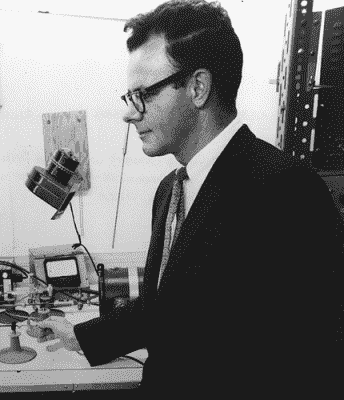
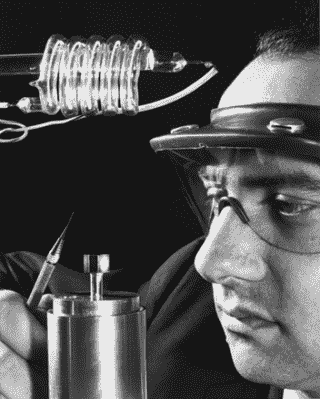
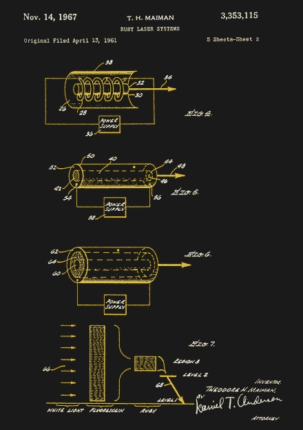

# 第一道光:激光的故事

> 原文：<https://hackaday.com/2018/01/08/first-light-the-story-of-the-laser/>

激光是当今如此重要的一项技术，以至于我们几乎没有注意到它们。激光如此便宜，可以作为玩具送人，如此多功能，可以使从 DVD 播放机到角膜手术的一切成为现实，是现代世界的建筑材料之一。然而，激光曾经是物理学家的专属领域，他们在庞大而昂贵的实验装置上工作，这些实验装置看起来更像是科幻小说中的东西，而不是通信和许多其他领域的工厂工具。激光取得了巨大的成功，它的发展故事是一个关于观察、毅力和做好笔记的重要性的有趣故事。

### 令人振奋的发展

就像 20 世纪下半叶几乎所有的重大创新一样，激光的起源可以追溯到贝尔实验室在新泽西绿树成荫的校园。但是，与那些仅仅来自伟大创新机构的一些发明不同，最著名的是晶体管，激光是世界各地几十年来发现和发展的结果。

即便如此，激光的发展在很大程度上是由贝尔实验室的母公司美国电话电报公司的命令推动的。20 世纪初，美国和世界各地的电话系统迅速发展，工程师们开始意识到简单的铜线不足以满足全球通信系统的需求。随着电报让位给电话，电视出现，很明显，他们必须寻找新的方法来传输更多的信息。这意味着更多的带宽，也意味着使用越来越高的频率。展望未来，他们意识到有一天光会成为媒介，但首先需要发明一整套技术。

虽然用光束通信是一个延伸的目标，但无线电通信的改进在 20 世纪 50 年代早期是可以实现的。再次展望未来，美国电话电报公司希望有一天在地球轨道上拥有通信卫星，作为远程连接的中继站。提供必要的带宽将需要微波链路，而到达轨道上的卫星将需要发射机和接收机的新设计。还需要一种放大微弱微波信号的方法。

Nobel Portrait of C.H. Townes. Source: [Nobelprize.org](https://www.nobelprize.org/nobel_prizes/physics/laureates/1964/)

进入查尔斯·哈德·汤斯，哥伦比亚物理学家和前贝尔实验室研究员。1950 年，汤斯正在探索受激发射现象，即入射光子可以与处于激发态的原子相互作用，将它们撞回到基态，并释放出一个在各方面与第一个光子相同的新光子。汤斯认为有可能使用这种光子复制机产生强烈的微波辐射束，并花了数年时间建造了一个装置来证明这一概念。

他将这一概念称为辐射受激发射的微波放大，并将他的装置命名为“微波激射器”。它利用氨气流通过一个窄缝和一个电场进入共振室。受激的氨原子将被腔室中的微波辐射“泵浦”,导致受激发射和大规模放大，释放为 24 GHz 左右的强大、高度聚焦的微波束。

汤斯在 1954 年展示了他的微波激射器，贝尔实验室很快采用了这种设备，并在 1957 年用固体晶体而不是氨气制造了他们自己的版本。他们也很快发现了该设备放大来自一颗尚未建造的通信卫星的微弱微波信号的潜力。然而，他们不用等太久，因为同年 10 月，人造卫星从头顶飞过，将人类带入了太空时代。

### 红色激光器

那时，汤斯回到了贝尔实验室，被重新聘为顾问。1957 年，他与贝尔实验室的同事兼妹夫亚瑟·肖洛(Arthur Schawlow)共进午餐，引发了一场关于微波激射器的讨论，讨论如何用它来放大比目前产生的毫米波更短的波长。微波激射器能被改造成放大光吗？肖洛已经在考虑用微波激射器放大红外光，而汤斯对在光谱的可见光部分产生强光的潜力很感兴趣。汤斯和肖洛提出了“光学微波激射器”的理论基础，并于 1958 年申请了专利。

Gordon Gould in 1950\. Source: [American Institute of Physics](https://history.aip.org/exhibits/laser/sections/whoinvented.html)

与此同时，在哈得孙河对岸的纽约市，一个名叫戈登·古尔德的年轻物理系学生也在沿着同样的思路工作。古尔德刚刚结束曼哈顿计划的一段工作，由于他过去与共产主义政治协会的关系而中断，他正在攻读光学和微波光谱学的博士学位。1956 年，他有了一个想法，用光泵而不是微波来实现受激发射。他和当时仍是哥伦比亚大学物理学教授的查尔斯·汤斯讨论了他的想法。

古尔德认为他的发明可以申请专利，但不知道申请专利的来龙去脉。汤斯建议他开始写下一切。古尔德买了一个便宜的笔记本，开始写下“激光可行性的一些粗略计算:受激发射的光放大。”

古尔德意识到，制造激光器的关键是设计一个合适的光学谐振腔。他的设计包括法布里-珀罗干涉仪中使用的那种平行反射镜，这是古尔德在博士工作中熟悉的设备。他知道他的笔记本代表了一个工作激光的基本完整的设计，他迫切地想为他的发明申请专利，所以他找到了一个公证人，让他见证了这个笔记本。古尔德认为这保护了他，并在一个错误的假设下工作，即他需要一个工作原型才能获得专利，他从哥伦比亚大学辍学，去一家财力雄厚的公司工作，以资助一个原型激光器。

古尔德取得了一些成功，他加入了一家私人研究公司技术研究小组。他说服他们资助他的研究，他们通过全新的高级研究计划局(ARPA)的拨款完成了这项研究。ARPA 的管理人员对古尔德的激光技术非常感兴趣，并慷慨资助。就在古尔德似乎能够制造出他的小玩意并申请专利的时候，他的过去又回来困扰着他。ARPA 认为该项目对国家安全至关重要，并立即将其列为机密。这意味着任何从事激光工作的人都需要安全许可，而古尔德年轻时的共产主义活动排除了这种许可。他实际上被排除在自己的项目之外。

### 红宝石棒

Theodore Maiman and his ruby laser. Source: [American Institute of Physics](https://history.aip.org/exhibits/laser/sections/whoinvented.html)

尽管受到古尔德缺席的阻碍，TRG 在可见光激光器方面取得了进展。当然，在 50 年代后期，TRG 并不是唯一一个致力于实用激光的实体。汤斯和肖洛仍在努力进行与古尔德惊人相似的开放式谐振腔设计，但他们是独立完成的。

最终，TRG 和贝尔实验室都在 1960 年 5 月被打败了，当时加利福尼亚州休斯飞机公司的物理学家 Theodore Maiman 令人震惊地宣布了一个可以工作的激光器。在那年 7 月的一次公开发布会上，麦曼展示了他的设备，该设备使用了现在人们熟悉的固态设计(在物理学意义上；半导体激光器是后来才出现的)红宝石棒，两端完全平行，部分镀银，放在带氙气闪光灯的反射器内。当被强大的蓝白氙弧泵浦时，红宝石晶体经历了受激发射，并释放出波长为 694 纳米的相干光脉冲，其能量足以点燃一根火柴，爆开一个气球，或在刀片上开一个洞。激光已经到达。

只要激光还在孕育中，它一旦诞生，进步就会迅速到来。同年晚些时候，使用氦和氖混合物的连续模式气体激光器被开发出来。两年后，第一台半导体红外激光器被展示出来，紧接着是可见光激光二极管。半导体激光器的发展最终导致了 1970 年第一个室温可见激光二极管的出现；以前的激光二极管需要用液氮冷却才能工作。半导体激光器的出现和光学纯玻璃纤维的平行创新意味着美国电话电报公司最终可以实现光通信的全部潜力。

### 注意到了

很难想象现代世界没有激光的好处，激光的许多创始人中的大多数都得到了应有的承认。汤斯与俄国人尼古拉·巴索夫和亚历山大·普罗霍罗夫一起获得了 1964 年的诺贝尔物理学奖，他们在汤斯设计微波激射器的时候一直在研究量子振荡器。

但是对戈登·古尔德角色的认可要等将近 30 年。他一次又一次地提起诉讼，试图证明他是激光的合法发明者，但一次又一次地遭到拒绝。尽管如此，他还是不断尝试。1987 年，在创建并运营了一家成功的光纤通信公司后，他终于获得了激光“光泵”方面的专利，部分基于他 30 年前在笔记本上勾画的设计。古尔德和他创建的专门进行专利战的公司最终控制了一家主要的激光制造商，并迫使其他大多数制造商支付专利使用费来许可他的专利。但是，尽管法律系统对激光的起源提出了自己的观点，但对于到底是谁发明了激光，科学界的观点至今仍是众说纷纭。