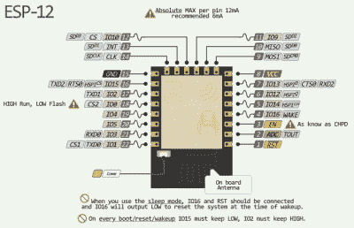
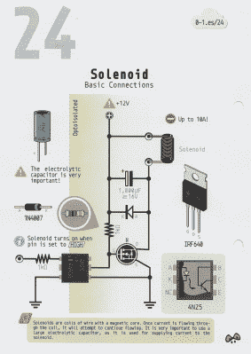
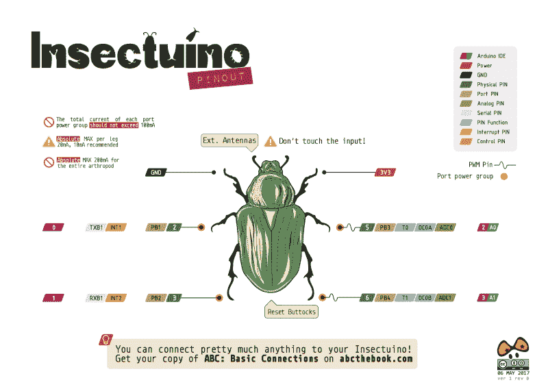

# 首先看看 ABC:基本连接

> 原文：<https://hackaday.com/2017/05/24/first-look-at-abc-basic-connections/>

[Alberto Piganti]，又名[pighixxx]从事电路图艺术已经有几年了，刚刚出版了一本书[，这本书可以在 Kickstarter](https://www.kickstarter.com/projects/pighixxx/abc-basic-connections-the-essential-book-for-maker) 上找到。他送了一份给我们审阅，我们花了一个小时左右喝了一杯提神的饮料，拿了一个装满漂亮电路图的活页夹。没有比这更好的了！

【pighixxx】开始为许多微控制器制作非常漂亮和实用的引脚排列图，然后扩展到模块和开发板，如 Arduino 和 ESP8266。他们很棒，我们会承认在我们的墙上有他的 [SMD ATMega328](http://www.pighixxx.com/test/portfolio-items/328/?portfolioID=337) 和 [ESP-12](http://www.pighixxx.com/test/2015/09/esp8266-pinout/) 的打印件。他的图形风格被广泛复制，这确实是最真诚的奉承。

但是在引脚排列之后，接下来是什么？当然，是以同样的风格完成的详尽的电路图。“ABC:基本连接”最初是 Arduino 项目中常用子电路的概要。但是你可以对“Arduino”持保留态度——这些对于一般的基于微控制器的项目都很有用。因此，无论您是想用低压微控制器驱动 12 V 螺线管，还是想用移位寄存器驱动多个 led，或者解码旋转编码器，这里都有适合您的电路片段。

[这是一种介于 PCB 布局程序中使用的原理图和 Fritzing 得到的原理图之间的中间状态。在前一种情况下，每个部件都有一个符号，但像微控制器这样的多功能部件只是用布满引脚编号的正方形来表示。在后一种情况下，给 IC 布线很容易，因为器件和引脚都是用图形表示的，但是不同的电线很快就没有颜色了，于是“试验板”就变成了一个老鼠窝，里面有任何复杂的电路。](https://hackaday.com/wp-content/uploads/2017/05/abc-51-debouncing_01.png)

“ABC”走中间路线，整体使用标准电路图风格，同时也是【pighixxx】擅长的 ic 和模块的好看的图形表示。2N2222 引脚是 EBC 还是 BCE？你不必去查，因为它已经给你画出来了。我们猜测，这种吸引人但信息丰富的风格非常适合目标受众——有一些电子产品经验但前臂上还没有纹上他们最喜欢的晶体管符号的人。[pighixxx]的图表简单、易于理解、易于使用，并且非常漂亮。

这本书计划在网上发行，对所有的电路设置有进一步的阐述。他们还没有完成，但他们有更多的 Fritzing 风格的味道，这种线到那个孔的图表。这种风格*在网上比在实体书上更有效，因为你可以一步一步地建立一个老鼠窝，没有一步会太难。但老实说，对于一个高级初学者或中级电子黑客来说，这本书可以当作单机来看。当排名新手遇到困难时，网页内容可能会对他们有所帮助。*

Tee-hee.

“ABC”中电路的宽度相当宽，涵盖了我们曾经遇到的大多数微控制器接口问题。没有一个电路是革命性的——它们是各种问题的可靠、正确的解决方案，而不是太粗糙或太聪明的东西。我们对任何电路都不感到惊讶，但我们也没有发现任何我们自己不会使用的东西。这些都是基本的联系，而且是一个非常坚实的集合。

总之，《ABC》是一本很有吸引力的书，采用了方便的活页夹格式，对于那些刚刚开始接触整个“Arduino”场景，但又对芯片与现实世界的接口感到困惑的人来说，这是一个很好的解决方案集合。它是许多常用器件的引脚排列的方便参考，结合了电阻、反激二极管、电平转换电路以及任何其他使它们工作所需的元件。这是我们希望我们的简单电路图看起来像什么。我们喜欢它。