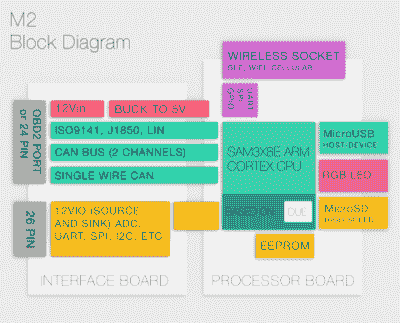
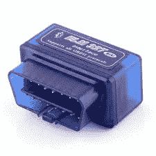

# 第一眼:Macchina M2

> 原文：<https://hackaday.com/2017/02/21/first-look-macchina-m2/>

在过去的几年里，我们已经看到汽车黑客的增长。更新的工具正在发布，这使得进入汽车修补领域更快更便宜。今天，我们先来看看 M2，这是来自苹果中国公司的一款新设备。

Macchina M1 是该公司首次发布的黑客友好型汽车设备。这是一个 Arduino 兼容板，它保留了 Arduino 的外形，但为汽车中最常见的协议增加了接口硬件。这使得任何熟悉 Arduino 的人都可以开始以熟悉的方式摆弄汽车。这种外形便于添加标准屏蔽，但对于用作连接到仪表板下工业标准 OBD-II 连接器的设备来说有点大。

Macchina M2 是一款重新设计的产品，它将 M1 的功能集压缩到一个更小的外形中，将设计模块化，并添加了一些新功能。随着[他们的 Kickstarter 今天](https://www.kickstarter.com/projects/1029808658/198395269?token=e40d156d)发布，他们给我们发了一个开发者工具包来回顾。这是我们第一次看到这个设备。

## 双板硬件设计 

M2 硬件包括两个主要部分:接口板和处理器板。

在接口板上，您可以找到最常见汽车协议所需的所有硬件。这里有两个高速 CAN 接口、一个单线接口 LIN 和较旧的协议(ISO 9141，J1850)。这一系列接口意味着硬件将与 1996 年以后生产的任何汽车兼容。还有一个接头用于提供与 MCU(gpio、ADC 等)的其他外部连接。

处理器板本质上是一个 Arduino Due，内置一个 USB 端口、led、SD 卡插槽和 EEPROM。设计的模块化特性允许将来更换或升级处理器板。最后，还有一个 XBee 兼容插座，用于添加蓝牙、WiFi 或甚至蜂窝数据。

M2 有两种外形:引擎盖下和仪表板下。仪表板下的型号在外形上类似于任何其他 OBD-II 加密狗。它正好安装在提供电源和连接的端口上。如果你正在寻找一个更持久的安装，引擎盖下的版本有一个自定义线束连接器。

## 软件

基本上，这个设备是一个 Arduino。[入门指南](http://macchina.cc/guide/m2/getting-started)介绍了 Arduino IDE 的安装、定制板的添加和演示。如果你曾经使用过 Arduino，这将是非常熟悉的。处理这些协议需要 Arduino 上的库。其中一些仍在开发中，但计划是在 Arduino 中支持所有这些，所以一个简单的草图将能够访问任何协议。

如果你打算使用一台配有 M2 的电脑，有一些选择。SavvyCAN 目前得到支持，SocketCAN 支持正在进行中，因此它将与 Wireshark 和 Linux 上的其他工具一起工作。好消息是，开放平台可以用来模拟几乎任何设备，所以通过一些工作，它可以支持许多已经存在的汽车黑客工具。

除了支持上述通信协议，还没有太多的软件。Macchina 希望让开发人员参与到硬件中来，第一批发货将会发给开发人员。虽然该软件还没有广泛的功能，但该项目的开源特性有望扩展该软件的功能。

## 不在

An ELM327 Dongle

每当我们看到 OBD-II 加密狗弹出时，评论者都会很快指出 ELM327 设备很容易获得，而且非常便宜。这是真的，我建议有车的人挑一辆。它们便于检查基本代码，并清除“检查引擎”灯(在汽车工程术语中，我们称之为“故障指示灯”)。

ELM327 性价比很高，但也有缺点。大多数使用 ASCII over Bluetooth 串行端口配置文件进行通信，这严重限制了数据吞吐量，并且无法在 iOS 上工作。该软件无法定制。没有为日志记录提供板载存储。蓝牙 pin 码总是 1234，所以如果你让它插着，任何路过的人都可以对你的车进行诊断！M2 的成本确实比这些设备高，但它也解决了许多这样的问题。

## 结论

对于想改装汽车的人来说，M2 是一款漂亮的新硬件。在被大众使用之前，它还需要在软件方面做更多的工作，但是它基本上已经准备好让黑客们开始工作了。开发者版本售价 99 美元，可以让你提前接触到测试版硬件。

有了这个硬件，你可以实现很多项目。它可以作为独立的高速车辆数据记录器。under the dash 模型可用于将第三方组件连接到车辆的 CAN 总线上，就像我们昨天看到的[这款令人惊叹的定制头单元](http://hackaday.com/2017/02/20/homemade-subaru-brz-head-unit-is-hidden-masterpiece/)一样，提供操作所需数据的翻译(方向盘按钮、音量调节车速等)。).加上蓝牙，你可以为你的车定制一个防盗器和遥控系统。使用手机数据，你可以跟踪车辆的位置，甚至远程关闭它。

我们对在 Hackaday 上讨论哪些众筹活动非常谨慎。Macchina 确实有交付硬件的记录，并向我们提供了一个测试版，他们将提供给开发者。该项目也是开源的，我们认为它将帮助人们参与汽车黑客活动。因此，我们认为这是一个值得与我们的读者分享的项目。