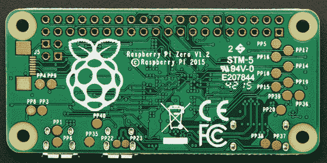

# 第一个树莓派零黑客-背驮式 WiFi。

> 原文：<https://hackaday.com/2015/11/28/first-raspberry-pi-zero-hack-piggy-back-wifi/>

而且我们有[第一个树莓派零黑客](http://www.hackerspace-ffm.de/wiki/index.php?title=Raspberry_PI_Zero_%2B_nano_USB_WiFi_Adapter_mod)！在距离正式发布不到 72 小时的时间里，[Shintaro]将 Edimax WiFi USB 适配器直接连接到 Pi Zero 的 USB 焊盘上。他无法忍受使用 USB 移动设备(OTG)打扰圆周率零点的小尺寸。需要 OTG 将板上的微型 USB 连接器转换为全 USB-A 连接器。

将外壳从 Edimax 和装置上取下，并用 Kapton 包裹以隔离暴露的焊点。电源取自电路板背面的 PP1 和 PP6 点。这些是来自 USB 电源的非稳压输入，因此应谨慎使用。一些便宜的 USB 电源在第一次连接时可以输出超过 5 伏的电压，这可能会让设备冒烟。

数据线连接到 PP22 和 PP23，也在背面，在 USB 数据连接器后面。由于 USB 是一种差分信号，这些导线被小心地保持等长，以避免信号失真。

在 Raspberry Pi B 2 上创建并编辑了一个 SD 卡来设置 WiFi 凭据。插入到零它启动良好，并启动了无线网络连接。

恭喜你，[Shintaro]第一次 Hackaday Raspberry Pi Zero hack。那是零日黑客吗？