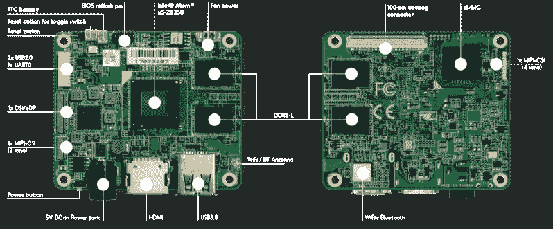

# 关于新型 UP 核心的初步思考

> 原文：<https://hackaday.com/2017/06/02/first-thoughts-on-the-new-up-core/>

我通常不谈论 x86 单板计算机，因为我对它们没有太多的话要说。它们太贵了，而且太热了，没什么意思。现在在 Kickstarter 上输入新的 UP 核心资金[。](https://www.kickstarter.com/projects/802007522/up-core-the-smallest-quadcore-x86-single-board-com)

UP 内核仅为 56.5 毫米× 66 毫米(2.2 英寸× 2.6 英寸)，由 64 位四核英特尔凌动处理器驱动，主频为 1.44 GHz 或 1.92 GHz。它将配备 2 GB 或 4 GB 的内存，以及 32 GB 或 64 GB 的 eMMC。该板有一个 USB 3 端口、HDMI、DSI/eDP 和两个 MIPI-CSI 端口，支持 2 MP 或 8 MP 摄像头。它同时内置了 WiFi 802.11 b/g/n 和蓝牙 LE。

换句话说，它足够强大，可以作为运行 Linux、Android 或完整 Windows 10 安装的桌面 PC。最便宜的 UP Core 配置——1gb 内存和 16gb eMMC——是€69，约合 75 美元。

## 连通性

在主板的下面，有一个 100 针 I/O 扩展连接器，支持 UART、SPI、两个 USB HSIC、PCI-Express、英特尔传感器集线器、SDIO 和 GPIO。

Top and bottom views of the UP Core. (Image credit: Aaeon Europe)

要连接到此总线，您可以向 Kickstarter pledge 添加一个(或两个)扩展板。第一块板暴露高速信号，如 PCI-express、Gb LAN 和 USB 3.0。第二个暴露低速信号，如 RS-232/422/484、I2C、I2S 和 GPIO。然而，也许更有趣的是，如果你设计并制作了一个扩展板，并且被 [UP 社区](https://up-community.org/)选中，你将有权获得你的板的版税，这些版税将在 [UP 商店](http://up-shop.org/)出售。

这听起来很像 littleBits BitLab 背后的概念，[早在 2014 年就开设了](http://littlebits.cc/introducing-littlebits-bitlab)作为用户生成硬件的“应用商店”，引起了制造商的极大兴趣，[在上个月底关闭了](http://littlebits.cc/the-bitlab-is-closed)，媒体对此关注较少。

你仍然可以购买 littleBits [硬件开发套件](https://shop.littlebits.cc/products/hardware-development-kit)，BitLab bit 开发就是围绕它进行的，但是没有机会向社区推销你自己的 littleBit。bitLab 和其他几个例子已经证明，运营一个特定于平台的市场实际上比看起来要困难得多。

## 选择，选择

UP Core 并不是第一个由同一家制造商在 Kickstarter 上融资的主板。[最初的上行板](https://www.kickstarter.com/projects/802007522/up-intel-x5-z8300-board-in-a-raspberry-pi2-form-fa)带有树莓 Pi 2 外形，并于 2015 年在 Kickstarter 上获得资助。现在通过 Mouser 在[总经销](http://www.mouser.co.uk/ProductDetail/AAEON-UP/UP-CHT01-A10-0464/)。随后，制造商带着[的 UP Squared](https://www.kickstarter.com/projects/802007522/up-squared-the-first-maker-board-with-intel-apollo/) 回到 Kickstarter，该产品于去年融资，[于上月底发货](https://www.kickstarter.com/projects/802007522/up-squared-the-first-maker-board-with-intel-apollo/posts/1900270)。

拥有 1.9 GHz 英特尔凌动处理器的最便宜的主板是€89，大约 100 美元。搭载 2.4 GHz 英特尔赛扬处理器的最便宜的 UP Squared 价格也差不多。然而，最初的 UP 板现在在 Mouser 上的零售价为€155.69 美元，这更像是 175 美元而不是 100 美元。这是一个相当大的价格上涨，我想当新的 UP Core 进入正常的零售渠道时，我们可以期待类似的价格上涨。虽然这些主板似乎确实在商店出售[，价格从 89 美元到 299 美元不等，配置数量多得惊人。](http://up-shop.org/4-up-boards)

## 它会飞吗？

这是我对 UP Core 的一个问题。有时候太多的选择并不是一件好事，正如许多 Kickstarter 项目创建者已经认识到的那样，给支持者这种选择会导致问题。苹果不给你太多的空间来配置你的 MacBook 是有原因的，而且市面上的树莓 Pi 机型屈指可数。

偏离最初的 Raspberry Pi 外形也可能是一个问题。正如[华硕修补板](http://hackaday.com/2017/04/24/official-launch-of-the-asus-tinker-board/)的成功所表明的，要击败 Pi 首先你必须建立一个更好的，现在我认为 UP Core 的主要竞争对手是稍微便宜一些的基于 ARM 的华硕修补板，而不是便宜得多且无处不在的 Raspberry Pi。

在一个对价格非常敏感的市场，你毕竟可以用 UP Core 的价格买到一台便宜的平板电脑。75 美元的 UP Core 对于普通制造商来说可能太贵了，以至于无法开始修补它。与许多 x86 驱动的单板计算机不同，我实际上认为这是一种有趣的计算机，但现在只需要很少的计算[就足够好了](https://medium.com/@aallan/capable-computing-50867847a8d8)。

在这个价位上，你不得不怀疑 UP Core 是否对大多数人来说计算量太大。当你可以用 89 美元买一台笔记本电脑的时候，为什么要为你不需要的更快的计算速度付费，为什么要为一台单板电脑支付 75 美元？