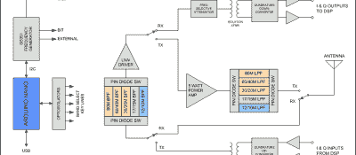

# 面向 Hams 的 5 瓦 SDR 收发器

> 原文：<https://hackaday.com/2016/11/20/five-watt-sdr-transciever-for-hams/>

廉价 SDR 硬件的出现为 SDR 软件创造了一个繁荣的生态系统，但推动这场革命的许多硬件仍然是“廉价的”。在过去的几年中，我们已经看到在许多设置中优质设备取代了电视加密狗，以及为它们设计的下变频器，允许它们在火腿波段上工作。

但是，如果业余无线电，尤其是其中的短波部分，是你的目标，一些专门建造的东西可能是更好的选择。首先，你可能想传输，但没有一个电视加密狗允许。然后，你可能想要一点权力。最后，如果你对短波很认真，你会更关心音频质量而不是巨大的带宽，所以你需要在接收端使用一些好的滤波器来帮助你从所有的噪声中提取信号。

RS-HFIQ 5w SDR 收发器可能适合你。它现在已经在 Kickstarter 上[了，如果你想要一个完全开源的(](https://www.kickstarter.com/projects/hobbypcb/rs-hfiq-5w-software-defined-radio-sdr-tranceiver?ref=3subao)[原理图](https://sites.google.com/site/rshfiqtransceiver/home/technical-data/schematics)、[固件](https://sites.google.com/site/rshfiqtransceiver/home/arduino-sketch)和[软件](https://sites.google.com/site/rshfiqtransceiver/home/software))短波 SDR 装备，它值得一看。它还兼容各种[开放式前端](http://www.stm32-sdr.com/)。

在我们看来，单板无线电并不是真正的 SDR 它解调无线电信号，并将 96 kHz [IQ](https://en.wikipedia.org/wiki/I-Q_signal) 信号发送到计算机的声卡，在那里进行采样和完全解码。这样做的好处是，专门构建的音频速率 DAC 具有相对较高的分辨率，但缺点是，进入计算机的频谱仅限于 96 kHz。这对于语音和代码传输来说非常好，但对于高带宽数据或跳频应用来说就不行了。但对于短波来说，这是一个合理的设计权衡。

然而，像这样的 SDR 与短波收音机的简单程度相去甚远。但是，如果你正在寻找建立自己的基于 SDR 的短波设置，并且你想在控制上比在收音机本身上做得更多，这看起来是一个好的开始。