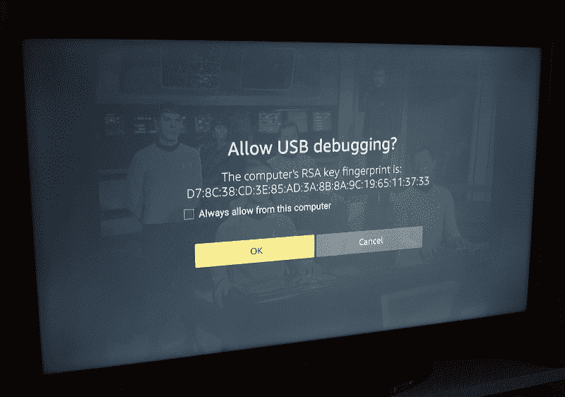
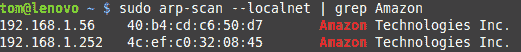

# 修复你不安全的亚马逊 Fire 电视棒

> 原文：<https://hackaday.com/2018/04/18/fix-your-insecure-amazon-fire-tv-stick/>

最近，我在一家酒店度过了一个基本上无眠的夜晚，出于好奇和无聊，我决定花些时间浏览客人网络，看看我的旅伴们可能在做什么。正如你可能预料的那样，我看到了三星和苹果设备的真正海洋。但在沉睡的主人身边，似乎有数不清的智能手机在充电，在这些手机中，我发现了一些有趣的东西。我正在挑选一些亚马逊制造的设备，它们都打开了端口 5555。

作为一个习惯性的 Android 修补者，这让我觉得非常奇怪。端口 5555 用于 [Android Debug Bridge (ADB)](https://developer.android.com/studio/command-line/adb.html) ，这是一个开发工具，用于通过网络或(更常见的)通过 USB 本地控制和执行 Android 设备上的各种管理任务。有正当理由需要在自己的设备上启用网络 ADB 的用户数量肯定相当少，因此至少可以说，在网络上同时看到半打用户似乎是不可能的。

为什么亚马逊制造的这么多设备都启用了网络 ADB？我意识到这其中肯定有联系，没多久就想通了。

## “越狱”火棍的肮脏世界

这个有点尴尬的名字叫做“Fire TV Stick ”,是一个便宜的小设备，你可以把它插在电视的 HDMI 端口上，把它变成一个“智能”电视。表面上，它允许你从所有大牌供应商那里获得内容，但实际上亚马逊希望它能让你在他们的生态系统中花更多的钱。对亚马逊来说，Fire Stick 之于视频内容，就像 Kindle 之于书籍一样:廉价出售硬件，并在随后的内容购买中赚钱。

Millions of Fire Stick owners have made the switch

不管怎样，这是计划。但没过多久，人们就意识到，Fire Stick 运行的是亚马逊定制版的 Android，而且特别容易安装额外的软件。正如你所料，一个巨大的 Fire Stick 修改和黑客社区在互联网的一些不太时尚的地方涌现出来，主要集中在将 Fire Stick 变成非法视频内容的最终设备。

你可能会问，怎么安装这个软件？这很简单，大约一千个不同的指南和 YouTube 视频将带你完成“越狱”你的消防棒的过程。你所需要做的就是进入“开发者选项”，启用“未知来源的应用”和“ADB 调试”。这些方便的指南没有解释这样做的危险，也没有提醒用户在安装了第三方软件(通常是 Kodi)后关闭这些设置。

最终结果是整个社区的人都在开发模式下使用亚马逊 Fire 电视棒，任何人都可以通过网络连接到这些设备，并获得对它们的完全控制。一个潜在的僵尸网络，由自愿的参与者创建。

## 现实风险

平心而论，这些火棒大部分永远不会离开用户的家。在这种情况下，虽然仍然没有好的*理由*允许这些设备上的远程 ADB，但风险可能足够低，让它开着不会有太大的危险。但是如果你在公共网络上使用“越狱”的消防棒，比如在学校宿舍或酒店，你就是在自找麻烦。

应该说，当一个设备试图通过远程 ADB 连接时，Fire Stick *确实会弹出一条消息。但这并不是一个可怕的描述性消息，当然也没有告诉用户这个庞大复杂的字符串意味着什么。它甚至没有说连接来自远程设备。雪上加霜的是，当提示符出现时，“OK”是默认操作。*

坦率地说，对于普通用户来说，这是一个非常可怕的“警告”消息。虽然在 Fire Stick 的正常操作过程中从来没有打算显示这个消息(记住，你必须首先启用“开发人员选项”来达到这一点)，但仍然。大多数人会简单地尽快按下“确定”按钮，把这个可怕的矩阵代码从他们的电视上去掉，这样他们就可以继续看网飞了。

一旦用户点击“确定”，游戏就结束了。随着 ADB 访问被批准，攻击者将可以自由地安装和执行他们自己的软件，擦除 Fire Stick，或者做任何他们想做的事情。

## 嗅火棒

如果你想继续寻找支持 ADB 的 Fire Sticks，你需要做的第一件事就是在网络上识别亚马逊制造的设备。有*多种*方法可以做到这一点，但是来自安装了 arp-scan 的 [*nix 机器](https://github.com/royhills/arp-scan)的快速一行代码看起来应该是这样的:`sudo arp-scan --localnet | grep Amazon`。这将找到本地网络上所有设备的 MAC 地址，然后通过管道传递给 grep，grep 将搜索单词“Amazon”的结果。

 如果是局域网上的，是亚马逊做的，那应该会给你它的 IP 地址。下一步是对每个 IP 进行端口扫描。同样，在不同的平台上有很多方法可以做到这一点，但是`nmap`总是一个好的选择。当然，如果只有一两个设备，你可以尝试用`adb connect`直接连接它们，看看会发生什么。

在修补这个概念的时候，我想出了一个 Python 脚本，它扫描本地网络寻找潜在易受攻击的亚马逊设备。这个脚本可以很容易地扩展为主动连接到这些设备并在其上执行命令(比如重启设备)，但是由于显而易见的原因，我将把它作为读者的练习。

## 外卖

这是一个很好的例子，说明为什么你在遵循网上发布的指南时需要格外小心。不管是出于无知还是漠不关心，为亚马逊 Fire Stick 创建这些 clickbait“越狱”指南的个人没有充分解释启用“开发者选项”的风险，Fire Stick 本身在警告普通消费者允许远程设备连接方面也没有做得更好。

记住这些“简单”的媒体播放器设备变得多么复杂也很重要。在 Fire Stick 的例子中，我们谈论的是一台运行 Android 的成熟电脑，以及所有需要的东西。你的 Fire Stick 有可能被特洛伊木马风格的应用程序入侵，然后成为你家庭网络的后门。看似廉价的观看流媒体电影的方式最终可能会比你预想的花费更多。

TL；DR:关闭远程调试。