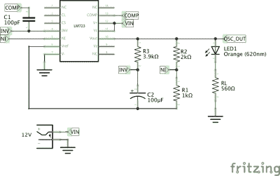

# 以 Widlar 方式闪烁 LED

> 原文：<https://hackaday.com/2018/05/11/flashing-an-led-the-widlar-way/>

定期 Hackaday 读者将熟悉 Boldport 的[Saar Drimer]在创造印刷电路板设计美感方面的工作。他最近的一项工作是 Widlar，这是向传奇集成电路设计师[Bob Widlar]致敬，为他的μA723 稳压器芯片提供开发板。

μA723 是一套零件，几乎任何调节器配置都可以用它来制造，但对[tardate]来说，它代表了一个挑战。μA723 是如此的多才多艺，以至于你所能创造的只是被建造者的想象力所限制。在做了普通的事情之后，[tardate]开始寻找一些非传统的东西。

 结果是适中的，一个简单的 LED 闪光器使用误差放大器作为不太好的运算放大器，构建一个频率约为 2 Hz 的振荡器。这非常简洁，如果你习惯将 NE555 作为通用集成电路，也许是时候将它留给显然更有用的μA723 了。

在 Hackaday，我们至少有一个μA723 的粉丝，更不用说[和巧妙的 PCB](https://hackaday.com/2016/01/28/beautiful-and-bizarre-boards/)了。如果 Widlar 看起来很熟悉，几个月前我们在上面介绍了μA723 数据手册中的开关模式调节器[。](https://hackaday.com/2018/02/15/the-micro-a723-as-a-switch-mode-regulator/)

披露:[Jenny List]为 Boldport 的 Widlar 工具包编写了[文档。](https://www.boldport.com/blog/bob-widlar-723)