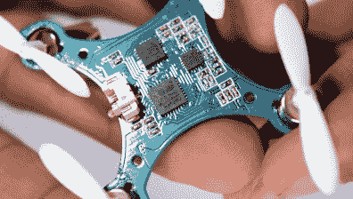
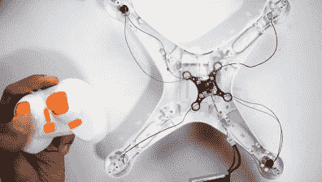

# 用纳米无人机的大脑驾驶正常大小的无人机

> 原文：<https://hackaday.com/2016/09/03/flying-a-normally-sized-drone-with-a-nano-drones-brain/>

无人机有各种各样的形状和大小，[凯达·宁巴尔卡尔]想知道一个小小的 Cheerson CX-10 纳米无人机的内脏是否可以带着一个更大的身体起飞，从而导致一个有趣的大脑移植实验。

为了他的测试，[凯达]获得了一架 CX-10 和一架更大的司马 X5SW 无人机的机身。在拆除了 CX-10 的 LiPo 电池和电路板(具有 STM32 ARM-core MCU、6 轴 IMU 和无线发射器)后，[Kedar]研究了板载 SQ2310ES 驱动器 MOSFETs 的数据表。他认为，在 6A 的最大持续电流额定值下，他们可能能够应对 X5SW 车身略大的电机的更高负载。它们似乎也没有过热，所以他只是将电路板原样安装到新的车身上，并连接好马达。

    

第一次试飞并不顺利。CX 10 号的大脑对它的新身体有点困惑，另外似乎还有一些机械故障。在稳定了摇摆不定的螺旋桨轴后，[凯达]能够很好地驾驶大型纳米无人机。自然，它不会飞得很稳定，股票 PID 设置使它希望回到年轻苗条，但这是一个开始。

这也是我们的读者进来的地方:[CX-10 上的定制固件](https://github.com/samuelpowell/CX10-FNRF)并不新鲜，所以除了它原来的外壳，你有没有在其他地方飞行过一个被清理的 CX-10 PCB？请在评论中告诉我们！请欣赏下面的视频，其中[Kedar]解释并放飞了他的 frankendrone:

 [https://www.youtube.com/embed/EltCLJGEm5A?version=3&rel=1&showsearch=0&showinfo=1&iv_load_policy=1&fs=1&hl=en-US&autohide=2&wmode=transparent](https://www.youtube.com/embed/EltCLJGEm5A?version=3&rel=1&showsearch=0&showinfo=1&iv_load_policy=1&fs=1&hl=en-US&autohide=2&wmode=transparent)

