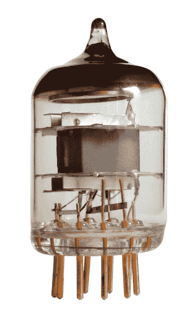
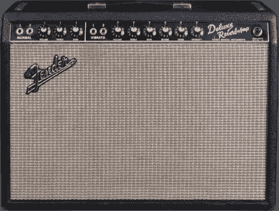

# 飞近火焰:超越特定限制的设计

> 原文：<https://hackaday.com/2016/03/24/flying-close-to-the-flame-designing-past-specified-limits/>

EEVBlog 论坛上出现了一个非常好的问题，我认为值得深入回答。海报问为什么电子管技术全盛时期的放大器公司在大规模生产的电路中操作电子管会远远超过他们公布的制造商推荐的限制。简单的答案是:因为他们可以逃脱惩罚。因此，真正值得探究的问题是，他们是如何在自己公布的限制之外运行的？让我们跳进来看看理由的集合。

### 基于材料的管性能

The getter of a vacuum tube (the silvery top) reacts with gasses produced by the tube elements during operation.

首先简单讨论一下电子管性能的限制因素。热和气体是电子管设计的两大敌人。此外，两者都是动态，因为热量将从内部管部件释放残余气体，且气体将中断正常操作，并且在最坏的情况下电离并导致气体短路。在某些管子中，这可能导致失控状态，从而导致完全失效。剩余气体与管道结构中使用的材料和零件的清洁、加工以及排空方式密切相关，对于大多数接收管道来说，这种情况最多也就是微不足道。大多数工厂仍然如此。此外，如果管中的材料没有保持严格的公差(特别是在阴极和栅极中)，则可能会有金属从热物体蒸发并沉积在较冷物体上的泄漏路径。你不想这样。镁和硅是最大的罪魁祸首之一，它们是常见的阴极还原剂，尤其是在较便宜的电子管中。它被用来加速阴极的老化和稳定，从而使其更快地出厂，代价是在寿命早期可能出现管子泄漏。含有这些还原剂的阴极基合金被称为“活性”阴极。后来使用了具有更大安全裕度的其他材料，但那是另一篇文章。

散热的下一个考虑因素是散热。这有三个方面。首先将热量从阳极辐射或传导至容器，在本例中为玻璃。其次是通过强制空气或对流、辐射，或者在某些情况下通过液体或散热器传导，将热量从表面带走。当设计许多这样的导管时，黑色镍阳极是标准，规格也是基于此。这类材料通常具有约 70-80%的黑体辐射当量和相对较低的热传导，这意味着您的阳极中有集中的热点，在玻璃中的对应热点处辐射，而玻璃是不良的热传导体，因此您现在有可能因灯泡中的温差而产生应力。第三，您可以通过引脚以更直接的方式散热，尤其是在微型导管中，引脚将热量直接传导至导管中最薄弱的玻璃/金属密封，然后再传导至插座触点本身。

在 20 世纪 60 年代，更好的多层材料变得可用，这将允许更大的阳极热传导，从而在辐射之前更均匀地传播热量。这些材料通常在某些点上镀铜，以增加其更好的热传导分布特性。

镀铝层利用特殊的热处理，使热辐射效率更高。这是电子管后半年阳极使用的灰色材料。这种材料的许多味道被用于德州仪器材料部门的最高执行者，并以 AlNiFer 的名字销售直到 90 年代中期。这是一种多层的钢、镍、铜和铝包层产品，制造方式与美国的宿舍非常相似。如今，许多电子管使用镀镍的钢阳极，在铜层之前有铝基涂层。随着时间的推移，这些以及清洁度和加工技术领域的其他改进带来了更好的管道性能。随着这些技术和工艺被应用到旧的管道设计中，它们的质量也得到了提高。

### 保守的评级

另一个主要因素是地铁公司倾向于保守地评价他们的地铁。许多工程师知道这一点，并将它用于他们自己的设计。前通用电气工程师告诉我，他们认为这是一个销售优势，因为他们会吹嘘自己产品的扩展功能，实际上只会分发工程数据表和数据集，告诉设计工程师如何调整他们的设计以获得最佳性能。

现在想象一下你正在努力让你的产品在市场上脱颖而出。众所周知，在音频行业，功率很重要，没有什么比以同样的价格获得更大的功率更好的了。当然，你可以用更坚固的变压器和更大的输出管来重新设计你的产品，但是这需要钱。让我们不要忘记，专业管，如 7591，EL34，6550，5881 和 8417 是一个数量级的更昂贵的行人 6BQ5，6V6 和 6AQ5 是由火车车厢负荷。你可以用那个 15 瓦的放大器，通过简单地在变压器的次级增加几圈就可以输出 20 瓦的功率，几乎不花什么钱，而且当电子管出现故障时，那些便宜的替代品只会在最近的商店里。这是一场游戏。

### 曲线外操作

The Fender Deluxe Reverb – and many other tube amps designed in the 50s and 60s – pushed tubes beyond their maximum published ratings. [Image source](https://commons.wikimedia.org/wiki/File:Fender1965DeluxeRev.jpg).

那些和我一起工作和交谈的人知道我从来没有真正相信过发烧友领域的神话和传说。我只把我所做的建立在可测量的事实上。这并不是说在我的分析中没有主观观点的空间，但一切都必须放在上下文中。在音频设计中有一些被称为“甜蜜点”的东西。我发现在某些设计中，这些地方通常是某些零件和管子超出其推荐范围的地方。芬达和音乐人的设计浮现在脑海里。当任何主要数据表(通用电气)中的最高设计最大额定值为 350 伏时，一个豪华混响通常可以将 400 伏以上的板电压加在不可靠的 6V6 电子管上。经验证据显示，从数以千计的这些单位在那里(许多与他们原来的管道仍然工作)，他们实际上可以处理这项服务。在某一点上，我们必须得出结论，公布的最大推荐规格就是这样。建议。

### 这超越了管道

在任何产品中，最容易失败的就是失败。MTTF 或“平均无故障时间”是质量控制工程师的口头禅，一家公司很快就会意识到，在制造问题之前解决问题比在设备投入使用后解决问题要便宜得多。不过，总会有下雨天。必须考虑到异常部分，并且必须假设您的产品对现场外部刺激的耐受程度。

这就是我们在设计中遇到的有时被称为“顶部空间”或“安全余量”的哲学。确保 1/4 瓦电阻始终正常工作的最佳方法是什么？确保它在 1/2 瓦的功率下也能做到这一点。这个想法很简单。在设计的健壮性上多花一点功夫，这样可以在将来避免大量的早期失败。好奇的工程师通常会探索这些额外的安全裕度并加以利用。然而，这通常取决于设备的销售市场。

你可以用你的生命打赌，一个医疗或安全气囊传感器设备已经通过了认证，它的一切都在这些推荐的规格范围内，因为当诉讼发生时，你可以确信任何差异都会受到一次又一次的质疑。与此同时，只要插上电源，计算机电源中的 1000 小时寿命电解电容一周 7 天一天 24 小时保持工作，看起来一切正常。这完全是在您的特定应用中可以承担多少责任的问题。