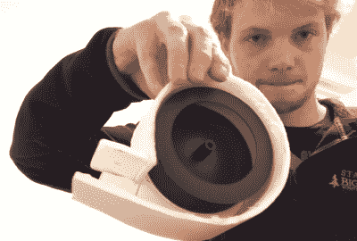

# 带鼠笼的飞行飞机

> 原文：<https://hackaday.com/2015/12/29/flying-planes-with-squirrel-cages/>

固定翼遥控飞机功率大得离谱。虽然普通的有人驾驶固定翼飞机需要考虑密度、高度、迎角和重量限制等因素，但大多数遥控飞机都可以悬停。这种疯狂的电力意味着有很大的实验空间，尤其是在新的和新颖的发电厂。[Samm Sheperd]有一个从壁式电暖器上取下的旧鼠笼风扇，他认为一个人的垃圾是另一个人爱好的组成部分，于是[围绕这个非常不寻常的风扇](https://www.youtube.com/watch?v=wg8ZbiC9IBw)造了一架飞机。

鼠笼式风扇[Samm]唯一重复使用的部件是叶轮。这个发电厂的其他部分要么是用泡沫板、胶合板建造的，要么是在无刷电机转动风扇的情况下，从每个建模者工作台上无处不在的垃圾箱中偷来的。

飞机的设计将鼓风机风扇直接放在机翼下面，将空气向后吹到尾翼下面。在测试过程中，[Samm]发现这台鼓风机从电池中消耗了大约 350W 的能量——如果在电机上安装一个大小合适的螺旋桨，这正是它应该消耗的能量。产生的推力并不是很大——重量为 863 克的机身产生的推力只有 400 克左右。这对于遥控飞机来说动力不足，但对于任何载人飞行器来说却是荒谬的强大。

飞机能用吗？当然了。[Samm]开着他的飞机在附近转了几圈，发现飞机飞得非常好。这是可怕的噪音，但它是一个很好的例子，说明了人们可以用廉价的泡沫钢筋混凝土飞机做什么。

 [https://www.youtube.com/embed/wg8ZbiC9IBw?version=3&rel=1&showsearch=0&showinfo=1&iv_load_policy=1&fs=1&hl=en-US&autohide=2&wmode=transparent](https://www.youtube.com/embed/wg8ZbiC9IBw?version=3&rel=1&showsearch=0&showinfo=1&iv_load_policy=1&fs=1&hl=en-US&autohide=2&wmode=transparent)

