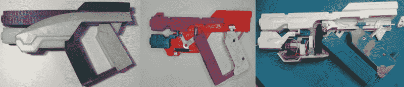

# 折叠质量效应手枪！

> 原文：<https://hackaday.com/2017/05/16/folding-mass-effect-pistol/>

视频游戏道具需要一个有技能的专门制作人来制作。当这些道具从质量效应宇宙中被拉出来时，需要更多一点的技术掌握。利用这些天赋，【乐观几何】已经制造了一个机动的，可折叠的 [M-3 掠夺者手枪](http://www.therpf.com/showthread.php?t=268287)！

这把枪是在 Fusion 360 中建模的，并在格拉斯哥 MAKLab 的 Ultimaker 2 上进行 3D 打印。[乐观几何]感到受到现实法则的限制，所以选择了较小的武器，认为这将是一个合适的入门级挑战。我相信你能猜到结果。

最终有三个主要的构建阶段，以及一个用于测试目的的弹簧加载版本。自始至终，[乐观几何]都在努力让部件完全打开或关闭，以及处理小外形。然而，彻底改革电机设计——包括一些限制器以免它自我解构——一个定制的锁存电路，显然——几个 led 灯的效果，产生了一个宏伟的道具。

 [https://www.youtube.com/embed/czZgoaCrI1I?version=3&rel=1&showsearch=0&showinfo=1&iv_load_policy=1&fs=1&hl=en-US&autohide=2&wmode=transparent](https://www.youtube.com/embed/czZgoaCrI1I?version=3&rel=1&showsearch=0&showinfo=1&iv_load_policy=1&fs=1&hl=en-US&autohide=2&wmode=transparent)

经过一年多的制作，尽管尽了一切努力，手枪仍然变化无常。尽管如此，它仍然令人敬畏，足以让我们想要一个自己的权利旁边的这个[随身武器副本](http://hackaday.com/2013/03/06/beautiful-replica-team-fortress-2-weapons/)属于团队堡垒 2 的间谍。