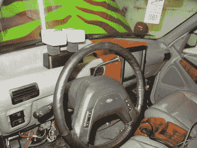

# 福特探险者以侏罗纪卡车的身份重生

> 原文：<https://hackaday.com/2016/01/28/ford-explorer-lives-again-as-a-jurassic-truck/>

《侏罗纪世界》上映后，人们对《侏罗纪公园》的兴趣大增，[配音]决定自己制作一辆属于自己的《侏罗纪公园》旅行车。唯一的问题？他住在英国，福特探险者在那里并不常见。

想要尽可能保持电影般的精确，他知道他必须得到第一代探索者，幸运的是，他设法在美国汽车脸书页面上找到了一个。他买了它，然后开始工作。

第一步是制造定制的保险杠和刷子防护装置，这是他从路虎改装而来的。然后他有很多画要画。**很多。**

一旦所有的东西都画好了，他就开始在仪表板上工作，整合一些古老的 CRT 显示器来播放巡演节目！

总而言之，这辆车看起来棒极了——他甚至把一些道具扔进了后备箱，包括一个自制的 Maxabeam 手电筒，当然，还有一些夜视镜。

你可能想知道为什么他们在侏罗纪公园电影中使用福特探险者？在书中，它们是丰田陆地巡洋舰(准确地说是 FJ62)。根据[斯皮尔伯格]的说法，他当时拥有一辆探险者，并认为这是一辆不错的卡车——但当他们从福特订购三辆时，他们得到了七辆，这当然不会有什么影响。

[通过 [r/DIY](https://www.reddit.com/r/DIY/comments/42dk02/converted_my_ford_explorer_into_a_jurassic_park/)