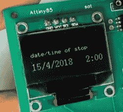

# 前烟民现在拍拍口袋寻找动力

> 原文：<https://hackaday.com/2018/04/24/former-smoker-now-pats-pockets-for-motivation/>

戒烟很难。相信我们，我们知道。成功的一半在于一开始就想放弃。一旦你这样做了，另一半大部分时间都在和自己斗争，直到足够的时间过去，食物变得更好吃，生命看起来更长。

 【丹科】最近戒烟了。因为闲散的手是大烟草公司的工具，他[通过建立一个口袋大小的动机](https://www.youtube.com/watch?v=_s3pvcO9wgU)让自己在那些痛苦的头几天里忙碌。这个小板子的主要目的是帮助他支持自己，显示从他最后一支烟开始的时间，他已经避免吸烟的数量，以及从那以后他节省的所有钱。一按按钮，他就能回忆起跳入冷火鸡湖的确切时刻。

当然，有一些应用程序会做同样的事情。但是任何试图戒烟的人都知道，当你的大脑处理毒素缺乏时，保持忙碌的每一分钟是多么重要。它运行在 ATtiny85 和 DS1307 RTC 芯片上。在我们看来,[Danko]采用了不同项目的电路板，我们喜欢这种可能性。

不抽烟吗？对你有好处。人类激励自己去做的第二难的事情是锻炼。这是一场终生的战斗，肯定可以通过一些游戏化来改善。

 [https://www.youtube.com/embed/_s3pvcO9wgU?version=3&rel=1&showsearch=0&showinfo=1&iv_load_policy=1&fs=1&hl=en-US&autohide=2&wmode=transparent](https://www.youtube.com/embed/_s3pvcO9wgU?version=3&rel=1&showsearch=0&showinfo=1&iv_load_policy=1&fs=1&hl=en-US&autohide=2&wmode=transparent)

