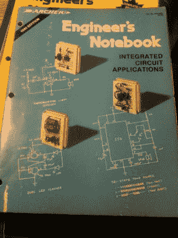
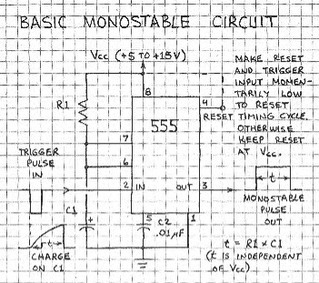

# 福里斯特·米姆斯、夏克电台和开创了一千种职业的笔记本

> 原文：<https://hackaday.com/2017/01/18/forrest-mims-radio-shack-and-the-notebooks-that-launched-a-thousand-careers/>

曾经有一段时间，Radio Shack 为电子爱好者提供了令人难以置信的各种用品。在每家商店的后面，经过逼真的 8 声道播放器、Minimus-7 扬声器、Patrolman 扫描仪的展示，就在电池柜的后面，在那里你可以兑现你的“每月电池俱乐部”卡，换一个新的免费 9 伏电池，放着最神圣的部分。铰链上的 Perfboard 面板装有 49 美分的电阻卡钉，2N2222 晶体管和电解电容器的泡罩包装，以及其他一切您需要的东西，让您的项目继续进行。对于初露头角的硬件爱好者来说，这是一个宝库。

但在旁边，总是在零件附近，有一个书架出售书籍，大多是阿彻品牌的。12 岁的我只有圣诞节和生日的钱可以花，而且我可以向父母乞讨，所以我倾向于买书——我想在开始花钱买零件之前我需要学习。像许多旧书一样，我最先拿起的一本书是[福里斯特·米姆斯三世](http://www.forrestmims.org/home.html)写的*工程师笔记本*。

Wish I could find my original copy from 1979\. I just bought this one from [Amazon](https://www.amazon.com/Archer-Engineers-Notebook-Integrated-Applications/dp/B000OZ93JU).

许多年过去了，我那本可靠的、破旧的 Mims 书的第一版，连同我的旁注和不止一处烙铁烧伤的疤痕，早已不翼而飞。我从那本书中学到了很多，当我用它来计划我的下一个大项目时，我经常想知道这本书是怎么来的。那些看过这本书及其任何续集的人，比如迷你笔记本系列，无疑会记得这本书的风格。用简单的线条画和图表印在柔和的绘图纸上，附带的文字似乎不是排版的，而是手写的。每一页都是技术美的作品，当我在自己的绘图纸笔记本上写满一页又一页我既没有时间也没有钱去制作的电路时，这给了我灵感。

我总是想知道那些书，以及它们是如何产生的。Radio Shack 做出了一个非常精明的营销决定，将它们发布在零件附近的显著位置，这使得导致今天“RadioShack”商店大幅减少的一系列糟糕的商业决策更加令人费解。幸运的是，Forrest Mims 最近在 reddit 上做了一个 AMA ，他回答了很多关于这些书是如何产生的问题。完整的《AMA》值得一读，但这里有一些低俗非小说经典的短篇故事。

像我们许多人一样，米姆斯没有受过正规的专业教育，而这些专业后来成为了他的职业。Mims 毕业于德克萨斯 A&M 大学，获得了政府学位，主要是自学电子学。在越南空军情报部门工作了一段时间，并被分配到空军武器实验室从事工程工作，由于没有工程学位，他需要获得特别许可。之后，米姆斯在 20 世纪 70 年代初继续自学电子学，就像他的工程师笔记本后来记录的那样——一次一个小项目。

Forrest M. Mims III. Source: [ForrestMims.org](//www.forrestmims.org/biography.html)

在共同创立了 MITS 公司(后来生产了 T2 的牵牛星 8800 T3)之后，米姆斯在电子爱好者和作家领域都获得了相当高的声誉。到 1975 年，他在*流行电子*杂志上有一个每月专栏，还为 Howard Sams 和他的公司写了几本业余爱好者书籍，Radio Shack 的技术编辑戴夫·冈泽尔(Dave Gunzel)就为他们工作的事与 Mims 进行了接触。他知道 Mims 的笔记本风格，并询问是否有可能使用相同的布局开发一本书。

米姆斯接受了挑战，在聚酯薄膜纸上费力地手写每一页。他回忆说，“一个错误就需要重做一整页”，这一努力“从我右手的中指中抽出了血。”这本书的前几页是用电动打字机“排版”的，以方便读者阅读后面的手绘页面。插图和示意图同样是手绘的，而且都是由米姆斯自己绘制的。

后来的*迷你笔记本*系列使用类似的技术制作，不过这次幸运的是使用了自动铅笔。每一卷花了大约三周的时间来制作，包括设计每个电路和建造四次以确保其工作正常。

Mims 的第一个*工程师笔记本*最终将售出 65 万本，更新的*工程师笔记本 II* 和*迷你笔记本*系列只会增加这个总数。这些数字不仅证明了书籍的内容和风格，也证明了 Mims 呈现主题的方式——简单的积木，容易理解为单元，而且很容易在试验板上构建。这些书实际上是在恳求读者进行实验，毫无疑问，它们帮助了 Radio Shack 销售零件和工具。

Image Source: Mims’ Mini-Notebook 555 Circuits scans via [Archive.org](https://archive.org/details/EngineersNotebookIIAHandbook)

但是 Mims 的书最引人注目的是它们的持久力。早在 reddit 的大多数核心人口出生之前，AMA 就首次出版了，它是对作品以及他们如何在电子行业开创许多职业生涯的持续赞赏。

我还受到了 Mims 如何将他的生活货币化的启发——他带着对科学和电子的热爱，充满活力地追求自己的目标，而没有考虑到他作为一名公民科学家在他工作的任何领域中缺乏正规教育。对于黑客社区来说，这是很有价值的课程，远远超过如何从 555 芯片构建单稳态多谐振荡器。

[专题和缩略图来源:Forrest M. Mims，III 编写的工程师迷你笔记本基本半导体电路。[来自 Archive.org 的扫描图像](https://archive.org/details/electronics_-_Forrest_Mims-engineers_mini-notebook_basic_semiconductor_circuits_)