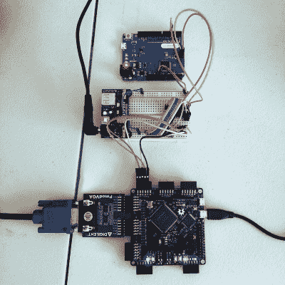

# FPGA Magic 将嵌入式小屏幕放在大屏幕上

> 原文：<https://hackaday.com/2018/03/11/fpga-magic-puts-little-embedded-screens-up-on-the-big-screen/>

老派手持游戏平台有一定的魅力，但公平地说，它们相对较小的屏幕并不适合更广泛的观看。这给想要在大屏幕上显示 Arduboy 游戏的[uXe]带来了一个问题，因此他采用 MyStorm BlackIce FPGA 板，创建了一个模拟 SSD1306 有机发光二极管显示器并具有 VGA 输出的转换器。

 在证明了这一想法的可行性后，它被移植到一个专用 PCB 上，并带有板载辅助设备，如用于 5 伏输入的电平移位器。令人兴奋的是，经过一些修改，它还模拟了 GameBoy 屏幕，允许在该平台上玩全尺寸游戏。但是这种黑客的力量并不局限于游戏。SSD1306 只是嵌入式显示器的几种不同通用标准之一。这个项目中的 FPGA 工作是为任何数量的显示器替代品构建 VGA 适配器的蓝图。我们很想看到一个 HD44780 模型！

正如你在下面的视频中看到的那样，其结果更符合有机发光二极管的精神，而不是高清沉浸式体验。但它确实有一种令人愉快的老式街机的感觉。

过去，在 MyStorm BlackIce 板上开始的几个项目已经在这里完成了。非常令人难忘的是 BBC 微型克隆使用了一个 T1。

 [https://www.youtube.com/embed/U4APoORfg0o?version=3&rel=1&showsearch=0&showinfo=1&iv_load_policy=1&fs=1&hl=en-US&autohide=2&wmode=transparent](https://www.youtube.com/embed/U4APoORfg0o?version=3&rel=1&showsearch=0&showinfo=1&iv_load_policy=1&fs=1&hl=en-US&autohide=2&wmode=transparent)

