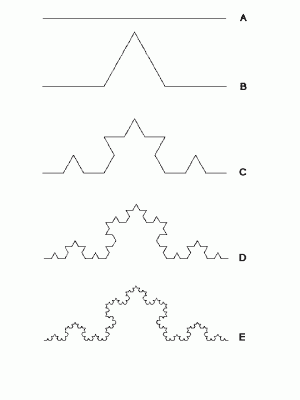
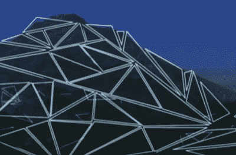
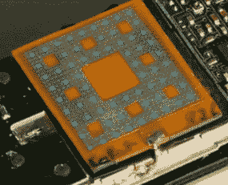

# 我们中间的分形

> 原文：<https://hackaday.com/2016/08/18/fractals-among-us/>

> 不要想你看到了什么，而要想你看到了什么
> 
> 伯努瓦·曼德尔布罗

随机性无处不在…或者你是这样认为的。想想早晨的云彩的各种形状，科罗拉多州落基山脉的锯齿点，英格兰海岸线的曲折和穿过黑暗暴风雨天空的闪电的分叉。这种不规则现象在我们的自然世界中司空见惯。人们也可以在生物学中找到类似的不规则结构。例如，你肺部的分支状结构称为支气管，以不规则的方式分叉，奇怪地反映了河流分叉成更小溪流的方式。事实证明，这些不规则的结构并不像人们想象的那样不规则和随机。它们是自相似的，这意味着当你放大或缩小时，整体结构保持不变。

描述这些不规则形状和图案的数学直到 20 世纪 70 年代随着计算机的出现才被完全理解。1982 年，一位名叫伯努瓦·曼德尔布罗的叛逆数学家出版了一本名为《自然的分形几何》的书。这是对他几年前出版的作品《分形:形式、机会和维度》的修订。今天，它们被认为是 20 世纪最有影响力的十篇科学论文之一。

Mandelbrot 创造了“分形”这个词，这个词来源于拉丁语 *fractus* ，意思是不规则的或者破碎的。他称自己为“分形主义者”，并经常称自己的工作为“对粗糙度的研究”。在这篇文章中，我们将描述什么是分形，并探索分形在现代技术中的应用领域，而将更多的技术方面留给后面的文章。

## 用科赫曲线测量海岸线

让我们马上开始一个老式的实验。你的工作是测量英格兰的海岸线有多长。假设你从一根码尺开始，然后完成测量，最终结果是 X 根码尺。现在让我们用一把 12 英寸的尺子试试。然后用一把 6 英寸的尺子。你会发现你的测量设备越小，你的海岸线测量变得越长。那么，如何精确测量海岸线的长度呢？

Source via [Southeastern Edu](https://www2.southeastern.edu/Academics/Faculty/jbell/fractals.html)

为了回答这个问题，我们必须熟悉一种叫做科赫曲线的分形技术，如左图所示。让我们想象一个等边三角形。取三角形的每一边，再放一个小三角形在上面。现在用小三角形的每一边做同样的动作。这个迭代过程创造了所谓的数学“怪物”，是一个悖论。方程产生一条无限的，因此不可测量的曲线。但是如果你画出方程产生的点集，你会发现一个封闭的有限形状，有时被称为[科赫雪花](https://en.wikipedia.org/wiki/Koch_snowflake#/media/File:Von_Koch_curve.gif)。左边的图像代表我们的等边三角形的一边。

这与我们的海岸线测量问题直接相关。当我们将测量设备变小时，海岸线的长度变得无限长，但显然有一个封闭的形状可以测量。Mandelbrot 认识到了这种联系，并开发了一种测量方法，不是测量海岸线的长度，而是测量它的“粗糙度”。为了理解这一点，我们需要调整我们对维度的理解。

直线是一维。三角形是二维的。如果我们认为科赫曲线位于两者之间，我们可以看到，随着我们迭代，我们增加了粗糙度。在左图中，E 比 c“粗糙”。如果我们把海岸线想象成科赫曲线的外部，我们可以用分形的迭代次数来测量这种粗糙度。这一见解将会使曼德尔布洛特在科学界声名狼藉。

## 好莱坞的分形

Source via [NOVA](https://www.youtube.com/watch?v=wkI0y43EqHI)

1978 年，Loren Carpenter 是波音公司的一名工程师，他试图开发一种软件来制作逼真的山区地形，用作飞机 CAD 模型的背景。他在一家书店偶然发现了曼德勃罗的第一本书，并从头到尾读了一遍。两次。

在那个时候，Mandelbrot 还不为人所知，术语“分形”也很少有人听说过。在书中，Mandelbrot 描述了自然界中有多少不规则的形状，包括山脉，可以被认为是分形。你可以做一个分形，取一个平滑的形状，把表面分成小块，把这些小块排列成自相似的图案，然后重复…类似于我们做科赫曲线的方法。卡彭特找到了解决办法。

在发现分形后的 72 小时内，他已经在电脑上制作出了山区地形。他用几个大三角形画出了一个粗糙的地形。然后，他编写代码将每个三角形分成 4 个独立的三角形。然后，通过一个叫做迭代的过程，重复这个分裂过程成千上万次。这个相对简单的过程的最终结果是一个逼真的山区地形。

卡彭特将继续与卢卡斯影业合作，并成为皮克斯动画工作室的联合创始人。

## 你手机里的分形

[Source](http://bloganten.ru/fraktalnye-antenny/)

我们许多黑客都非常熟悉不同的射频频率需要不同的天线。你的手机有几个射频设备:WiFi、蓝牙和蜂窝收发器等等。大多数手机的每个收音机都没有单独的天线。你手机中的单根天线就是所谓的 [Sierpinski 地毯](https://en.wikipedia.org/wiki/Sierpinski_carpet)分形。事实证明，这种类型的天线是接收不同频段信号的最有效方式，适用于设备中的所有无线电设备。

我希望你喜欢我们的分形之旅。当然，在我们的日常生活中还有更多分形的例子。请在下面的评论中告诉我们你遇到的任何问题。

 [https://www.youtube.com/embed/wkI0y43EqHI?version=3&rel=1&showsearch=0&showinfo=1&iv_load_policy=1&fs=1&hl=en-US&autohide=2&wmode=transparent](https://www.youtube.com/embed/wkI0y43EqHI?version=3&rel=1&showsearch=0&showinfo=1&iv_load_policy=1&fs=1&hl=en-US&autohide=2&wmode=transparent)

**来源**

主图-[分形科学工具包](http://www.fractalsciencekit.com/)

缩略图-[维基共享资源](https://commons.wikimedia.org/wiki/File:Sierpinski_carpet_5.svg)