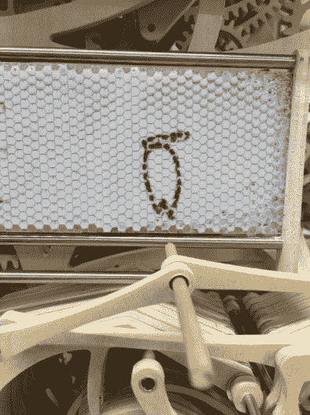

# 神奇的钟

> 原文：<https://hackaday.com/2016/02/12/frickin-amazing-clock/>

我们已经展示了很多钟的构造，但是这一个，如标题所示，非常惊人。才华横溢的艺术生[ [坎戈·铃木](https://twitter.com/BellTreeNursing) ]在攻读产品设计专业的路上，作为一个项目，建造了这个[木制机械钟](https://translate.google.com/translate?sl=ja&tl=en&js=y&prev=_t&hl=en&ie=UTF-8&u=http%3A%2F%2Fwithnews.jp%2Farticle%2Ff0160208003qq000000000000000W00o0401qq000012997A&edit-text=)。在这个[环节](http://grapee.jp/en/56100)有更好的翻译。请务必查看休息时间下方的视频。

[Kango]的设计概要是做一些“对人类来说容易，但对机器来说很难”的事情。手写符合要求，尽管建造机器对一个人来说也不容易——他需要六个月的时间来计划这个项目。

这个钟在一块磁性板上用小时和分钟记录时间。每过一分钟，擒纵机构就会启动近 400 个木制齿轮、齿轮和凸轮。先将棋盘倾斜，擦除旧的数字，然后用四个触控笔书写新的数字。

这个时钟没有任何微控制器、Arduinos、伺服系统或任何其他电子设备。整个机械装置由一组四个重物通过重力提供动力。[Kango]说他最大的挑战是获得同时写数字的机制。虽然他正确地处理了几何图形，但数百个木制部件的累积扭曲和弯曲导致数字失真，直到他调整了错误。

  Number 8, “before” modifications  Number 8, “after” modifications

从 2 月 9 日到 2 月 14 日，可以在东北艺术设计大学看到 Kango 的“写作钟”，所以如果你在那个地方，一定要去看看。你甚至可以看到他在微调他的杰作。

感谢[Dave Ehnebuske]发送这个提示。

 <https://video.twimg.com/ext_tw_video/696232511018442752/pu/vid/720x1280/QeZ08mA8PHY2KIdE.mp4?_=1>

[https://video.twimg.com/ext_tw_video/696232511018442752/pu/vid/720x1280/QeZ08mA8PHY2KIdE.mp4](https://video.twimg.com/ext_tw_video/696232511018442752/pu/vid/720x1280/QeZ08mA8PHY2KIdE.mp4)