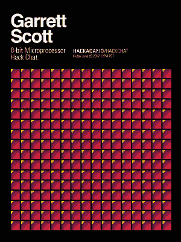

# 周五黑客聊天:带微芯片的 8 位微处理器

> 原文：<https://hackaday.com/2017/06/07/friday-hack-chat-8-bit-micros-with-microchip/>

几年前，微芯片以 35.6 亿美元收购了 Atmel。有很多 8 位微控制器的制造商，但是每个人都生产 8051，而 MSP430 并没有受到应有的欢迎。微芯片对 Atmel 的收购创造了可能是最大的 8 位微芯片制造商，其产品组合从米粒大小的芯片到巨幅图片。

 本周五，[我们将与微芯片公司 8-bitters 的技术营销工程师](https://hackaday.io/event/25196-8-bit-micro-processor-hack-chat)进行一次黑客聊天。如果你喜欢 AVR，这就是你要找的人。如果你还在摇 1993 年的老爷车，这就是你要找的人。

在这个黑客聊天的摘要上是一些新的图片和一些非常有趣的外设。ADCC——计算领域的 A2D——和可配置逻辑单元一起摆在桌面上。这次聊天还将介绍 MP Lab Xpress 等微芯片设计工具。

当然，这些黑客聊天是针对社区的问答会话。我们鼓励每个人问几个关于微芯片的问题。我们已经为这个黑客聊天开放了一个讨论指南。如果您有问题，[只需将其添加到列表](https://docs.google.com/spreadsheets/d/1JwQ-RzYceeUrCMs9BcZ2--k5O8IBmSL6vZ-er-u5O58/edit?usp=sharing)中。

如果你不能进行黑客聊天，不要担心。我们会有整个谈话的记录。聊天结束后不久，这里的应该会有[可用。](https://hackaday.io/event/25196-8-bit-micro-processor-hack-chat)

### 以下是参与方式:

 我们的 Hack Chat 是 Hackaday.io 上的实时社区活动 [Hack Chat](https://hackaday.io/project/5373-hacker-channel) 群发消息。这次黑客聊天将在太平洋时间 6 月 9 日星期五中午举行。如果你需要时区帮助，这里有一个奇特的时间和日期转换器。

登录 Hackaday.io，访问该页面，并寻找“加入这个项目”按钮。一旦你成为这个项目的一部分，这个按钮就会变成“团队信息”，直接带你进入黑客聊天。

你不必等到星期五；随时加入，你可以看到社区在谈论什么