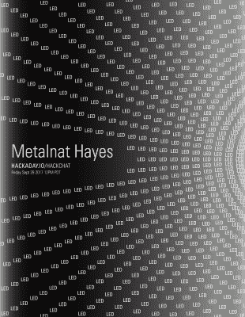

# 周五黑客聊天:关于 LED 设计的一切

> 原文：<https://hackaday.com/2017/09/27/friday-hack-chat-all-about-led-design/>

在过去的二十年里，有三项伟大的使能技术。第一个是锂电池，它能容纳大量的电力。没有它们四轴飞行器就不会存在，特斯拉 Model S 也不会。第二个是疯狂强大的无刷电机。这里，再一次，如果没有它们，四边形就不会存在，但我们也在变得更小、更敏捷、更强大的运动平台。

 近年来第三大使能技术是 led。还记得 PlayStation 2 出来的时候，大家都被蓝色的 LED 惊艳到了吗？那个蓝色 LED 获得了诺贝尔奖。现在，我们有了 LED 灯泡，彩虹中任何颜色的 LED，强大的紫外线 LED，以及数十亿支烛光手电筒。led 棒极了。

在本周的 Hack Chat 中，我们将讨论 led。从条状到环状，从离散到防水，从穗轴到怪异的颜色，以及介于两者之间的一切。如果你正在寻找用 led 取代你的车间照明，这是适合你的聊天工具。如果你曾经想知道 led 的质量，以及性价比，这是给你的。这都是关于闪亮的珠宝。

我们本周 Hack Chat 的嘉宾将是【Metalnat】，Burbank MakerSpace 的创始人，他最近在[供应框架设计实验室](https://hackaday.io/project/80-supplyframe-design-lab)工作，在那里他设计了一个虚拟现实控制器，并在*起重机*上工作，这是一个扑翼机器人，在今年的火人节上滑过 playa。在这次聊天中，我们将讨论 LED，包括安装方法、LED 类型、供应商和 LED 制造方法。

这是一个黑客聊天，所以我们接受观众的提问。这里有一张电子表格，我们将用它来引导讨论。

### 以下是参与方式:

 我们的黑客聊天是在 [Hackaday.io 黑客聊天群发消息](https://hackaday.io/project/5373/token/7879571d-62c3-46a8-af36-2b6f265590f2?redirect=messages)上的现场社区活动。这次聊天将在太平洋时间 9 月 29 日星期五中午进行。恒星和太阳让你沮丧吗？想知道这个月的中午是什么时候？没问题:[这里有一个方便的倒计时器！](https://www.timeanddate.com/countdown/generic?iso=20170929T12&p0=137&msg=LED+Hack+Chat&font=cursive)

点击右边的语音气泡，你会被直接带到 Hackaday.io 上的黑客聊天群。

你不必等到星期五；随时加入，你可以看到社区在谈论什么。