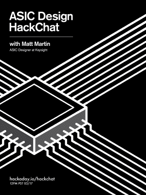

# 周五黑客聊天:ASIC 设计

> 原文：<https://hackaday.com/2017/03/15/friday-hack-chat-asic-design/>

加入是德科技 ASIC 设计师[的【Matt Martin】，参加本周的黑客聊天](https://hackaday.io/event/20319-asic-design-hack-chat)。

每周，我们都会发现一些有趣的人在制造东西，这些东西制造所有的东西，让他们坐在电脑前，让他们透露现代制造和技术实际上是如何发生的。这是黑客聊天，时间是 3 月 17 日星期五中午(太平洋标准时间 20:00)。

 【马特】自 2007 年以来一直在安捷伦/是德科技工作，担任 ASIC 设计师。这项工作从合成到逻辑门的代码开始。之后，[马特]把这些门放进硅里。他研究过从 0.13 微米到 28 纳米的工艺。将代码转化为芯片在这里仍然是一门黑暗的艺术，如果你曾经想知道所有这些是如何工作的，这是你找到答案的机会。

### 以下是参与方式:

 我们的 Hack Chat 是 Hackaday.io 上的实时社区活动 [Hack Chat](https://hackaday.io/project/5373-hacker-channel) 群发消息。

登录 Hackaday.io，访问该页面，并寻找“加入这个项目”按钮。一旦你成为这个项目的一部分，这个按钮就会变成“团队信息”，直接带你进入黑客聊天。

你不必等到星期五；随时加入，你可以看到社区在谈论什么。

### 即将开始的黑客聊天

当谈到我们的黑客聊天时，我们有很多要讨论的。3 月 24 日，我们将讨论电子管放大器在音频应用中的优势。四月份，我们邀请了杰出的黑客 Samy Kamkar 来谈论逆向工程。

因为我从来没有机会这样做，而且因为这些黑客聊天公告帖子从来没有得到多少评论，我打算把这一个扔在那里。基于 1972 年的技术建设一座硅制造厂需要什么？我在这里说的是 10 微米的工艺，这个东西*可能*能够克隆 6502。技术在我们这边——激光打印机比几平方英尺的 rubylith 便宜——石英管加热器和引线键合机可以在剩余市场上找到。有没有可能在你的车库里建立一个硅晶圆厂而不破产？在评论中留下你的想法，然后带着它们参加本周五的 Hack Chat。