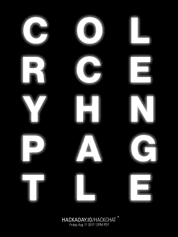

# 周五黑客聊天:加密挑战

> 原文：<https://hackaday.com/2017/08/09/friday-hack-chat-crypto-challenge/>

现在是八月中旬，这意味着所有的黑客都从 DEF CON 回来了，穿着他们的连帽衫，带着烟雾弥漫的赌场的记忆，有趣的谈话，以及最重要的加密挑战。

 今年对于 DEF CON 来说是“不景气”的一年。有一个官方徽章，但它不是电子的(这是谁也没想到的)，也没有加密挑战(这是谁也没想到的)。尽管如此，[已经有一个充满活力的徽章建造者社区](http://hackaday.com/2017/08/04/all-the-hardware-badges-of-def-con-25/)，DEF CON 的加密爱好者们今年对来自加密和隐私村、弯曲者和暗网电话拨号的 PCB 锁感到满意。

这些加密挑战是如何构建的？这是本周黑客聊天的主题。本周五，我们将与 DEF CON 的加密和隐私村的一名成员坐下来，讨论这些奇怪的代码是如何构建的，获胜者是如何确定的，以及用于*解决*这些挑战的技术。

本周，我们将讨论加密挑战实际上是如何工作的，如何在固件中、在激光雕刻的丙烯酸板上以及在 PCB 的丝网印刷中放置加密。我们将讨论加密挑战是如何产生的，以及如何解决它们。将特别关注*测试*一个加密挑战；也就是说，当你已经知道如何解决它时，你如何确定它是可解的？

虽然这个黑客聊天只会持续一个小时，但我们不可能在这段时间内涵盖创建加密挑战的所有提示、技巧和技术。如果你想进一步阅读，[lost]出现在我们的[十周年聚会](http://hackaday.com/2014/10/27/the-solution-to-the-10th-anniversary-code/)上，告诉我们他在过去几年里为 DEF CON 创作了这些谜题。

### 以下是参与方式:

 我们的 Hack Chat 是 Hackaday.io 上的实时社区活动 [Hack Chat](https://hackaday.io/project/5373-hacker-channel) 群发消息。这次黑客聊天将在太平洋时间 8 月 11 日星期五中午举行。不知道地球的太阳什么时候会直接在头顶上？这里有一个时间和日期转换器！

登录 Hackaday.io，访问该页面，并寻找“加入这个项目”按钮。一旦你成为这个项目的一部分，这个按钮就会变成“团队信息”，直接带你进入黑客聊天。

你不必等到星期五；随时加入，你可以看到社区在谈论什么。