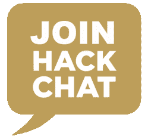

# 周五黑客聊天:设计 RF 产品

> 原文：<https://hackaday.com/2017/02/15/friday-hack-chat-designing-rf-products/>

本周五，我们将讨论射频。加入我们的讨论，利用 Hackaday 的 Jenny List 设计 RF 产品。这一切都发生在 hackaday.io 上的[黑客聊天中。](https://hackaday.io/project/5373-hack-chat)

当珍妮不忙于为 Hackaday 写文章时，她就坐在牛津 Hackspace 的董事会上。她是[语言间谍](http://www.languagespy.com/)的幕后智囊，销售包括接收器、过滤器和射频分线板在内的电子套件。她在 hackaday.io 上非常活跃，并且已经使用 Pi Zero 将[传输到大西洋彼岸](https://hackaday.io/project/9484-the-australia-project)。

像往常一样，我们将在太平洋时间周五中午(或周五 20:00 GMT)开始这次黑客聊天。这里有一个方便的倒计时。

### 以下是参与方式:

 我们的 Hack Chat 是 Hackaday.io 上的实时社区活动 [Hack Chat](https://hackaday.io/project/5373-hacker-channel) 群发消息。

登录 hackaday.io，访问该页面，并寻找“加入这个项目”按钮。一旦你成为这个项目的一部分，这个按钮就会变成“团队信息”，直接带你进入黑客聊天。

你不必等到星期五；随时加入，你可以看到社区在谈论什么。

### 即将开始的黑客聊天

hackaday.io 上的黑客聊天正迅速成为一种*事物*。我们已经有了嵌入式系统之神的万神殿，包括 Adafruit 的 Lady Ada、Sprite_tm 和 bunnie。

3 月份，我们将与 Raspberry Pi 工程师 Roger Thornton 进行一次黑客聊天，并与 Fictiv 进行一次机械制造黑客聊天。你可以在这里查看[所有即将到来的黑客聊天。](https://hackaday.io/event/19578-upcoming-hackchats)