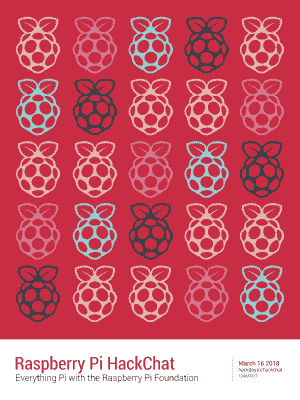

# 周五黑客聊天:一切树莓派

> 原文：<https://hackaday.com/2018/03/14/friday-hack-chat-everything-raspberry-pi/>

Raspberry Pi 已经有六年的历史了，在这段时间里，它已经成为最流行的单板电脑。在过去的几年里，Pi 已经从一个基于智能手机 SoC 的相对缺乏活力的板改进为一个速度惊人的板，它加载了一些我们见过的最好的软件和最好的社区支持。你可以用 Pi 做很多事情，Raspberry Pi 基金会的持续支持已经使数百万人得到了一台运行 Linux 的廉价计算机。太棒了。

现在轮到你问这台微型计算机背后的工程师，圆周率的世界里发生了什么。本周五我们将举行一次非正式的聊天，你也受邀参加。

 我们本周 Hack Chat 的嘉宾是[Roger Thornton]，他是 Raspberry Pi 的首席硬件工程师，负责监督 Raspberry Pi 产品的设计、测试、合规和生产。之前，[Roger]在 Broadcom 的工作包括作为团队的一员，对众多 SOC 进行表征和测试，包括各种 pi 中的 BCM2835/6/7。他还拥有智能家居和物联网领域的经验，曾在一家咨询公司工作，帮助将芯片推向市场。

【罗杰】最近的作品[今天公布](https://hackaday.com/?p=298343)；Raspberry Pi 3 Model B+是 Pis 漫长产品线中的最新产品，虽然它不是具有 SATA、PCIe、千兆网络和 4G 功能的八核 ARM 怪兽，但它比它的前代产品功能更强，价格仍然不到 40 美元。

这也是[Roger]第二次做客我们的 Hack Chats。[你可以在这里查看 2017 年聊天记录](https://hackaday.io/event/20043-raspberry-pi-hackchat/log/54287-edited-transcript-of-raspberry-pi-hack-chat)。

在这次聊天中，我们将讨论 Raspberry Pi 产品的未来，世界各地的 Pi 活动，以及许多人心中的一个问题:在哪里可以大量购买 Pi 零。当然，我们鼓励你在 Hack Chat 中添加自己的问题。你可以通过[将问题作为评论留在这个 Hack Chat 的活动页面](https://hackaday.io/event/69365-raspberry-pi-chat)上。

我们的 Hack Chat 是在 [Hackaday.io Hack Chat 群发消息](https://hackaday.io/project/5373/token/7879571d-62c3-46a8-af36-2b6f265590f2?redirect=messages)上的实时社区活动。本周它将在通常的时间，太平洋时间，3 月 16 日，星期五中午，发生。想知道这是什么时间在你的地盘发生的吗？[有倒计时器！](https://www.timeanddate.com/countdown/generic?iso=20180316T12&p0=137&msg=Raspberry+Pi+Hack+Chat&font=cursive)

点击右边的语音气泡，你会被直接带到 Hackaday.io 上的黑客聊天群。

你不必等到星期五；随时加入，你可以看到社区在谈论什么。