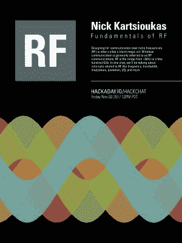

# 周五黑客聊天:RF 基础

> 原文：<https://hackaday.com/2017/11/01/friday-hack-chat-fundamentals-of-rf/>

设计一个通过射频通信的系统是一门黑暗的艺术。这是一个模糊的领域，充满了光感、无处不在的电线和虚数。射频是完全留给巫师的。那个把麦克斯韦方程简化成我们现在使用的形式的人简直疯了，他把家里所有的家具都换成了花岗岩。这真是奇怪的东西，伙计。

 [对于本周的黑客聊天](https://hackaday.io/event/27914-fundamentals-of-rf-hack-chat)，我们要谈论的是射频。从不同频段的功能、带宽如何融入设计、不同调制方案、RF 概念、I/Q、奈奎斯特频率，以及其他阐释宇宙奥秘的深入主题，包括*所有*数学。

如果你想知道比特是如何变成无线电波的，PSK 和 SSB 是怎么回事，无线电系统的带宽和范围是如何影响所用频率的，这就是你要找的聊天工具。

我们本周黑客聊天的嘉宾是[[Nick Kartsioukas](https://hackaday.io/explodinglemur)。他是一名信息安全工程师，一名拥有额外执照的业余无线电操作员，硬件黑客，研究无线电和天线项目，SDR，他是一名遥控飞机飞行员。有很多 RF 在[尼克]周围游走，他有能力支付账单。

这是一个社区黑客聊天，我们接受来自社区的问题。如果您有问题或想要讨论的事情，[将其添加到表单](https://docs.google.com/spreadsheets/d/14DApYIwcEGZl9mGEpwNx7DsVLW19e6A74DpYT5C6mO8/edit?usp=sharing)。

 我们的黑客聊天是在 [Hackaday.io 黑客聊天群发消息](https://hackaday.io/project/5373/token/7879571d-62c3-46a8-af36-2b6f265590f2?redirect=messages)上的现场社区活动。这次聊天将在太平洋时间 11 月 3 日星期五中午进行。你希望每个时区都是 UTC 吗？是的，这是个好主意，但是当你仔细想想，它会很糟糕。[这里有一个时区转换器！](https://www.timeanddate.com/countdown/generic?iso=20171027T14&p0=137&msg=DMX+Control+Systems+Hack+Chat&font=cursive)

点击左边的语音气泡，你会被直接带到 Hackaday.io 上的黑客聊天群。

你不必等到星期五；随时加入，你可以看到社区在谈论什么。

我们也在寻找新的黑客聊天主持人！如果你已经做了一些很酷的东西，你正在做一个有趣的项目，或者你将要推出一个非常酷的产品，请联系我们！给我们出色的社区经理发电子邮件，我们会看看是否能把你安排进去。