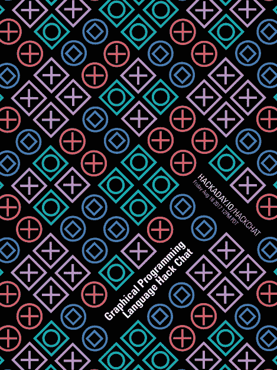

# 星期五黑客聊天:Boian Mitov 的图形化编程语言

> 原文：<https://hackaday.com/2017/08/16/friday-hack-chat-graphical-programming-languages-with-bojan-mitov/>

可视化或图形化编程语言有着悠久的历史，它们中的大多数比微软的 Visual Basic、C#和 Visual Studio IDE 的名称更有意义。有些人不喜欢编码，对他们来说，图形化编程语言用易于理解的框和线代替了分号和括号。

 本周五，我们将[和【Boian Mitov】一起讨论图形化编程语言](https://hackaday.io/event/26311-graphical-programming-language-hack-chat)。他是一名软件开发人员，Mitov Software 的创始人，也是嵌入式领域图形化编程语言 Visuino 的创造者。该 IDE 支持从 Arduino 到 Teensy、ESP8266、ESP32、chipKIT 和 Maple Mini 的所有产品。这是一种简单的微控制器编程拖放方式，很容易让人感到痒(看到我在那里做了什么吗？)提供了一种向非程序员介绍嵌入式世界的简单方法，并且还提供了一种构建定制应用程序的更快方法。

说到图形化编程语言，我们找不到比[Boian]更好的 Hack 聊天嘉宾了。他是 OpenWire 数据流处理技术(另一种图形编程语言)、IGDI+库、VideoLab、SignalLab、AudioLab、PlotLab、InstrumentLab 的作者，也是 Visual C++的 VCL 的作者。他也是《布莱士·帕斯卡》杂志的定期撰稿人。

在这次聊天中，我们将讨论什么使得可视化编程值得，它如何以及为什么工作，什么时候不工作，以及如何开发一种图形化编程语言。维苏伊诺将会引起特别的兴趣，我相信有人会提出一个问题，“在阿尔伯特的领导下，马克斯/MSP 发生了什么”。如果您对[Boian]，[有问题，这里有一张问题表来指导讨论](https://docs.google.com/spreadsheets/d/1L54ps__sTScIQqamefYh95n4K9Ldz0UBSbx4_miYEq0/edit?usp=sharing)。

### 以下是参与方式:

 我们的 Hack Chat 是 Hackaday.io 上的实时社区活动 [Hack Chat](https://hackaday.io/project/5373-hacker-channel) 群发消息。这次黑客聊天将在太平洋时间 8 月 11 日星期五中午举行。这里有一个时间和日期转换器！

登录 Hackaday.io，访问该页面，并寻找“加入这个项目”按钮。一旦你成为这个项目的一部分，这个按钮就会变成“团队信息”，直接带你进入黑客聊天。

你不必等到星期五；随时加入，你可以看到社区在谈论什么。