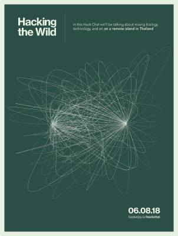

# 周五黑客聊天:入侵荒野

> 原文：<https://hackaday.com/2018/06/06/friday-hack-chat-hacking-the-wild/>

快到夏天了，这意味着我们正处于会议季节的开始，至少对技术和网络安全人群来说是这样。如果你没有意识到，会议是酒店-工业综合体的一个阴谋，是一种在一个蹩脚的酒店房间和 25 美元的汉堡包上花费数千美元的可怕方式。

【Andrew quit Meyer】正在筹备一个实验性的学术会议，这可能会结束会议季的恐怖。他正在创建自己的名为 [Dinacon](http://www.dinacon.org/) 的会议，尽管是在太平洋的一个热带岛屿上，但参加费用会更低。

[在本周的黑客聊天](https://hackaday.io/event/158212-hacking-the-wild)中，我们将与[Andrew]谈论 Dinacon，这是一个为期两个月的免费会议，有来自除南极洲以外各大洲的 140 多名与会者参加。[Andrew]在新加坡国立大学从事“数字自然主义”的研究，将生物野外工作与 DIY 工艺相结合。本次会议的重点将是研讨会，与会者在野外建立技术，旨在与自然互动。

不仅 DIY 电子产品的交集对 Hackaday 社区来说很有趣，从逻辑的角度来看，这也是一个有趣的会议。[会议理念](https://www.dinacon.org/2017/11/01/philosophy/)非常清楚地阐明了这一点，主要观点是【Andrew】自己出资举办这次会议。举办这次会议只需要大约 10，000 美元。)，甚至还有几笔旅游津贴可以周转。这也是一个长达两个月的会议。我向你保证，在处理了超级市场、Hackaday 聚会和 Hackaday 举办的所有其他活动之后，这非常有趣。甚至是闻所未闻。

在本周的聊天中，我们将讨论:

*   *什么是数字自然主义？*
*   *DIY 电子在森林里是什么样子？*
*   *你从[黑野](https://www.sciencechannel.com/tv-shows/hacking-the-wild/)中学到了什么？*
*   迪纳孔的人们制造什么样的东西？
*   你的电子实验中最大的错误是什么？

当然，我们鼓励你在讨论中提出自己的问题。你可以在 [Hack Chat 活动页面](https://hackaday.io/event/158212-hacking-the-wild)上发表评论，我们会将其放入 Hack Chat 讨论的队列中。【T2

我们的 Hack Chat 是在 [Hackaday.io Hack Chat 群发消息](https://hackaday.io/messages/room/2369)上的实时社区活动。本周和以往一样，我们将在太平洋时间 6 月 8 日星期五中午聚集在我们的视频终端前。[这里有一个倒计时钟，直到黑客聊天开始](https://www.timeanddate.com/countdown/generic?iso=20180608T12&p0=871&msg=Hacking+The+Wild&font=cursive)。

点击右边的语音气泡，你会被直接带到 Hackaday.io 上的黑客聊天群。

你不必等到星期五；随时加入，你可以看到社区在谈论什么。