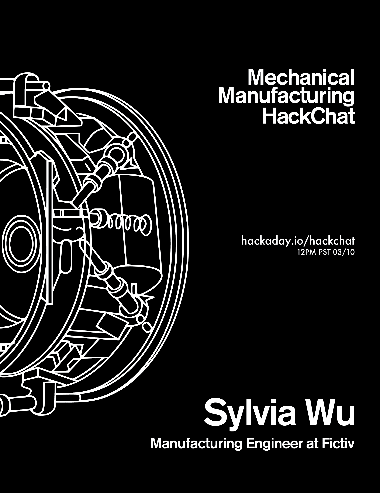

# 周五黑客聊天:机械制造

> 原文：<https://hackaday.com/2017/03/08/friday-hack-chat-mechanical-manufacturing/>

加入 Fictiv 的高级制造工程师 Sylvia Wu，参加本周的黑客聊天。[Sylvia]在 Fictiv 的工作让她对现代制造业有了独特的看法。该公司将工程师与快速制造联系起来，接受设计并将其发送到拥有工具和时间来快速制造零件的商店。这意味着一遍又一遍地看到同样愚蠢的错误，但也要在它们经过时抓住最酷的新花样。她还花时间拆开消费品，看看它们是如何制造的，增加了他们可用工艺的武库，既有经过时间考验的，也有新奇的。

任何对制造业感兴趣的人都需要加入这个聊天。在您的日历上标记本周五 3/10 中午(太平洋标准时间 20:00)

### 以下是参与方式:

 我们的 Hack Chat 是 Hackaday.io 上的实时社区活动 [Hack Chat](https://hackaday.io/project/5373-hacker-channel) 群发消息。

登录 Hackaday.io，访问该页面，并寻找“加入这个项目”按钮。一旦你成为这个项目的一部分，这个按钮就会变成“团队信息”，直接带你进入黑客聊天。

你不必等到星期五；随时加入，你可以看到社区在谈论什么。

### 即将开始的黑客聊天

3 月 17 日星期五，黑客与是德科技的工程师们讨论示波器的芯片设计。

