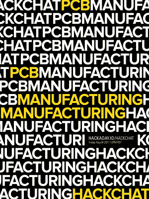

# 周五黑客聊天:PCB 制造

> 原文：<https://hackaday.com/2017/08/02/friday-hack-chat-pcb-manufacturing/>

建造某样东西的一个和建造某样东西的多个的*之间有着天壤之别。投入制造的努力并不是线性的，制造本身就是一种技能。本周五，我们将在 Hackaday.io 上[谈论 PCB 制造和组装](https://hackaday.io/event/26092-printed-circuit-board-pcb-manufacturing)*

 在甲板上参加这次黑客聊天的将是【乔纳森·赫希曼】，他是 [PCB:NG](https://www.pcbng.com/turnkey-pcb-assembly) 背后的智囊，一家总部位于纽约市的交钥匙电子制造初创公司。 [Jonathan](https://hackaday.io/Jonathan.PCBNG) 是一个自学成才的硬件家伙，精通 PCB 布局、3D CAD 和制造技术。PCB:NG 本质上是采用 oldskool 制造技术，并使其更加数字化。PCB:NG 让任何人都可以轻松地制造他们的设计，并且以最具成本效益的方式完成。

这个黑客聊天是关于什么的？我们将讨论如何开始 PCB 制作。这项工作最好的工具是什么？最好的工具是什么，不像汽车那么贵？每种工具的优缺点是什么，在设计使 LED 闪烁的电路板之前，您应该了解哪些 RF 知识？

然而，这并不是仅仅关于多氯联苯的闲聊。我们还将讨论制造业。具体来说，为制造而设计，如何对电路板进行嵌板，当你忘记基准时会发生什么，如何使你的设计制造成本低廉，当你将 SMD 元件放在电路板的两面时会发生什么。

我们正在接受每个人的提问，所以请随意向问题表添加一些内容以供讨论。

### 我们正在寻找黑客聊天主持人！

如果你不喜欢 PCB 制造和设计，或者即使你喜欢，我们也在寻找黑客聊天主持人。如果你在某个领域有专长，[给我们打电话](editor@hackaday.com)。我们已经和[的树莓派工程师](https://hackaday.io/event/20043-raspberry-pi-hackchat)聊过几次，他是 [ESP32](https://hackaday.io/event/19601-esp32-hackchat) 背后的杰出人物之一，我们还谈过[混合信号示波器的 ASIC 设计](https://hackaday.io/event/20319-asic-design-hack-chat)和[高端音频放大器](https://hackaday.io/event/20627-audio-amplifier-hack-chat)。我们会接听所有来电，如果您有什么想与社区分享的，请发送电子邮件给我们。我想提一下，现在是燃烧季节，与 playa 上的艺术家聊几句会很棒，特别是如果他们能告诉我们如何将 747 的机身移动几百英里。

### 以下是参与方式:

 我们的 Hack Chat 是 Hackaday.io 上的实时社区活动 [Hack Chat](https://hackaday.io/project/5373-hacker-channel) 群发消息。这次聊天将在太平洋时间 8 月 4 日星期五中午进行。困惑于‘中午’是在何时何地？这里有一个时间和日期转换器！

登录 Hackaday.io，访问该页面，并寻找“加入这个项目”按钮。一旦你成为这个项目的一部分，这个按钮就会变成“团队信息”，直接带你进入黑客聊天。

你不必等到星期五；随时加入，你可以看到社区在谈论什么。