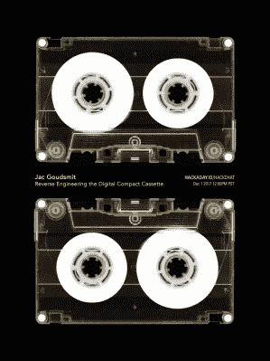

# 周五黑客聊天:逆向工程的数字压缩磁带

> 原文：<https://hackaday.com/2017/11/29/friday-hack-chat-reverse-engineering-the-digital-compact-cassette/>

 在本周的黑客聊天中，[我们将讨论数字盒式磁带的逆向工程](https://hackaday.io/event/28313-reverse-engineering-the-digital-compact-cassette)。我们为什么要关心一个上市才四年的过时格式呢？因为如果一个装满氪石的*口袋的复制品在二手市场上卖 50 美元，它*有*是好的。*

20 世纪 90 年代初，几种不同的数字磁带格式出现了。迷你光盘是磁光的，是的，但在过去，它是录制盗版音乐的绝佳选择。DAT 在 90 年代初也出现过，对于录音棚来说简直是天赐良机。1992 年推出了另一种格式，即数码盒式磁带。它向后兼容标准的盒式录音带，这是一个重要的特点，因为没有人愿意用一种新的数字格式来取代他们所有的盒式音乐收藏。那简直是疯了。

我们本周 Hack Chat 的嘉宾是[Jac Goudsmit]，Hackaday.io 上的多产创作者，他的项目从[L-Star 软件定义的 6502 计算机](https://hackaday.io/project/3620-l-star-software-defined-6502-computer)到[GPS 控制的慧鱼时钟](https://hackaday.io/project/7679-gps-controlled-fischertechnik-clock)。[Jac]是在宠物 2001 上长大的，几年来，他参与了许多项目，从光刻设备的运动控制系统、取放机，甚至是一个无线电小屋。在这次聊天中，他将讨论数字压缩磁带的历史，立体声 PCM 如何录制到磁带的幕后，以及其他话题，如荷兰和美国 CS/EE 职业的差异。

 我们的黑客聊天是在 [Hackaday.io 黑客聊天群发消息](https://hackaday.io/project/5373/token/7879571d-62c3-46a8-af36-2b6f265590f2?redirect=messages)上的现场社区活动。我们的黑客聊天通常发生在周五中午，所以系好安全带，因为这将在 12 月 1 日周五 12:00 PST **进行。你住的地方现在是几点？谁在乎！这里有一个时区转换器！**

点击左边的语音气泡，你会被直接带到 Hackaday.io 上的黑客聊天群。

你不必等到星期五；随时加入，你可以看到社区在谈论什么。