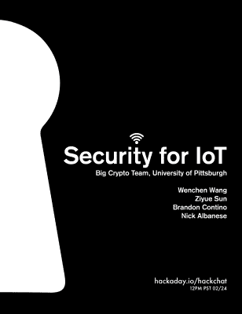

# 周五黑客聊天:物联网安全

> 原文：<https://hackaday.com/2017/02/22/friday-hack-chat-security-for-iot/>

 在过去的几周里，我们在 hackaday.io 上的每周[黑客聊天聚集了一大群人。本周，我们将讨论人类面临的最大威胁:带有网络浏览器的烤面包机。](https://hackaday.io/project/5373-hack-chat)

本周黑客聊天的主题是物联网的安全性，因为有人用配置不当的网络摄像头关闭了互联网。

本次聊天由匹兹堡大学的大型加密团队主持。[陈文·王]、[孙子岳]、[布兰登·孔蒂诺]和[尼克·艾博年]将接受有关连接到互联网的轻型设备的提问。讨论将包括构建安全连接到更大网络的东西。

UP 的大型加密团队正在考虑人们在项目中实施安全性时遇到的障碍，以及冷漠或无知是否是最严重的物联网罪犯甚至没有考虑安全性的主要原因。

黑客聊天定于 2 月 24 日星期五中午太平洋标准时间(20:00 GMT)进行。

### 以下是参与方式:

 我们的 Hack Chat 是 Hackaday.io 上的实时社区活动 [Hack Chat](https://hackaday.io/project/5373-hacker-channel) 群发消息。

登录 Hackaday.io，访问该页面，并寻找“加入这个项目”按钮。一旦你成为这个项目的一部分，这个按钮就会变成“团队信息”，直接带你进入黑客聊天。

你不必等到星期五；随时加入，你可以看到社区在谈论什么。

### 即将开始的黑客聊天

这些黑客聊天变得非常受欢迎，这在很大程度上归功于我们主持的优秀演讲者阵容。我们已经有了[Lady Ada]、[Sprite_tm]和[bunnie]——他们是各自领域的顶尖工程师、黑客和开发者。不过，我们并没有固步自封:几周后，我们将与 Raspberry Pi 的工程师罗杰·桑顿(Roger Thornton)和机械制造大师 Fictiv 进行黑客聊天。