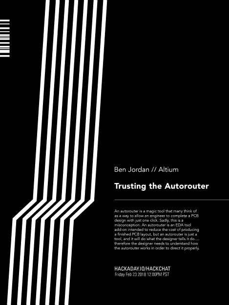

# 周五黑客聊天:信任自动路由器

> 原文：<https://hackaday.com/2018/02/21/friday-hack-chat-trusting-the-autorouter/>

啊，自动路由器。在每个 PCB 设计工具中，都有一个称为“自动布线器”的功能。如果使用正确，该功能能够自动在焊盘之间铺设走线，在一分钟内制作出完美的电路板。问题是，没有人使用它。我们被告知不要相信自动路由器，我们也听到了许多其他可怕的警告。自动路由器从不工作。自动布线器会在任何地方留下痕迹。自动布线器不考虑布局规划，有时你会得到直接穿过电路板边缘的走线。是避免自动路由器的声音建议？

 [对于本周的黑客聊天](https://hackaday.io/event/56777-trusting-the-autorouter)，我们谈论的是信任自动路由器。自动路由器只是一个工具，就像任何工具一样，它会完全按照你说的去做。因此，问题是要足够聪明地使用自动路由器。

我们本周黑客聊天的嘉宾是 Altium 社区工具和内容总监[本·乔丹](https://hackaday.io/jordanyte)。Ben 是一名计算机系统工程师，在电路板级硬件和嵌入式系统设计方面拥有 25 年的经验。他 8 点拿起烙铁，12 点写一些汇编。他也是成功使用自动路由器的专家。

在本次聊天中，我们将与 Ben 讨论电路制造商 Altium，以及如何让自动布线器发挥最佳性能。你如何设置自动路由器？你如何测试你的设置？实际上，进入自动路由器的技术和数学是什么？设计多层板的最好方法是什么？你是如何进行多电路板设计的？混合信号是怎么回事？

我们的 Hack Chat 是在 [Hackaday.io Hack Chat 群发消息](https://hackaday.io/project/5373/token/7879571d-62c3-46a8-af36-2b6f265590f2?redirect=messages)上的实时社区活动。这次聊天将于太平洋时间 2 月 23 日星期五中午进行。想知道你们这一带什么时候会发生这种事吗？[在这里，看看整洁的时区转换器。](https://www.timeanddate.com/countdown/generic?iso=20180223T12&p0=137&msg=Trusting+the+Autorouter&font=cursive)

点击右边的语音气泡，你会被直接带到 Hackaday.io 上的黑客聊天群。

你不必等到星期五；随时加入，你可以看到社区在谈论什么。