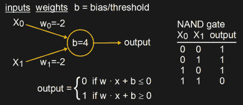
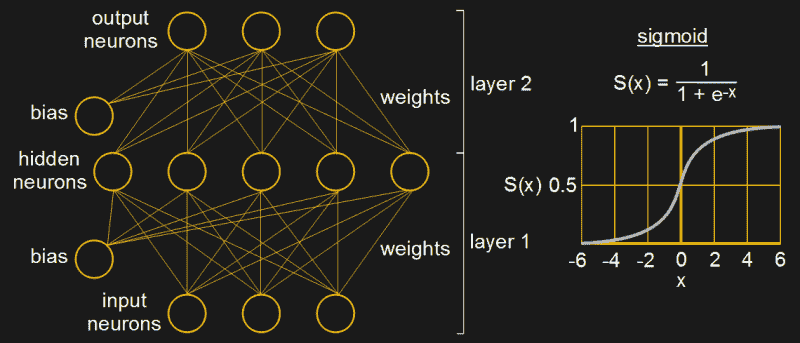
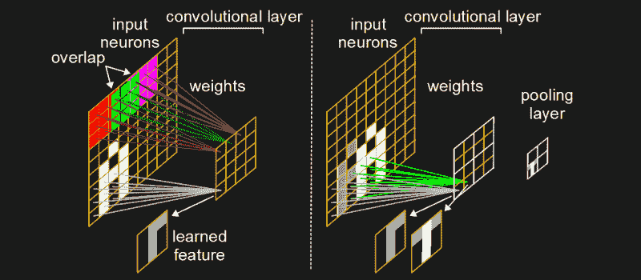
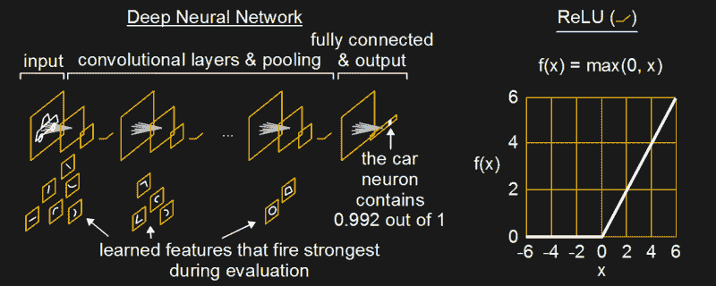
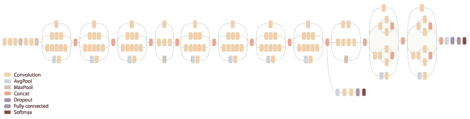
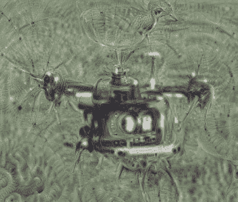
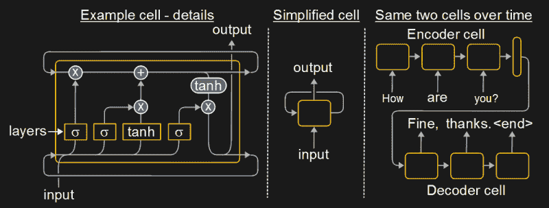
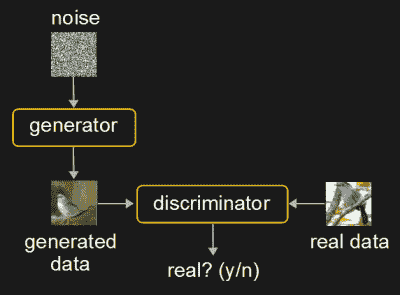

# 从 50 年代的感知器到我们今天正在做的怪异的东西

> 原文：<https://hackaday.com/2017/06/08/from-50s-perceptrons-to-the-freaky-stuff-were-doing-today/>

事情越来越诡异了。几年前，谷歌向我们展示了[神经网络的梦想是噩梦](http://hackaday.com/2015/06/24/inceptionism-mind-blown-by-what-neural-nets-think-they-see/)的素材，但最近我们看到它们被用于赋予[游戏角色与人类难以区分的运动](http://hackaday.com/2017/05/05/game-characters-move-better-with-neural-networks/)，用于创建[只有文字描述的真实感图像](https://arxiv.org/abs/1612.03242)，用于为无人驾驶汽车提供[视觉，以及更多其他用途。](https://www.tesla.com/en_CA/autopilot)

能够做好这一切，并且在某些情况下比人类做得更好，是最近的发展。创建逼真的图像只有几个月的历史。那么这一切是怎么发生的呢？

## 感知机:40 年代、50 年代和 60 年代

The perceptron

我们从 20 世纪中叶开始。当时一种流行的早期神经网络试图使用一种称为感知器的人工神经元来模仿生物大脑中的神经元。我们已经在 Al Williams 的一系列文章中详细讨论过感知器[，但是简单来说，一个简单的感知器如图所示。](http://hackaday.com/2016/11/02/machine-learning-foundations/)

给定输入值、权重和偏差，它产生 0 或 1 的输出。可以为使与非门工作的权重和偏置找到合适的值。但是由于 Al 文章中详述的原因，对于 XOR 门，你需要更多层的感知器。

在 1969 年一篇名为“感知机”的著名论文中，明斯基和帕佩特指出了感知机无法为某些问题提供理想解决方案的各种情况。然而，他们指出的条件只适用于单层感知器的使用。当时就知道，甚至在论文中也提到，通过在输入和输出之间增加更多的感知器层，称为隐藏层，可以解决许多问题，包括 XOR。

尽管如此，他们的论文还是让许多研究人员望而却步，神经网络研究也因此退居幕后长达十年之久。

## 反向传播和乙状结肠神经元:80 年代

1986 年，由 David Rummelhart、Geoffrey Hinton 和 R.J. Williams 撰写的另一篇名为“通过错误传播学习内部表征”的著名论文使神经网络重新流行起来。在那篇论文中，他们发表了许多实验的结果，这些实验解决了 Minsky 谈到的关于单层感知器网络的问题，促使许多研究人员重新采取行动。

此外，根据 Hinton 的说法，他仍然是当今神经网络领域的关键人物，Rummelhart 已经重新发明了一种训练神经网络的有效算法。它包括从输出传播回输入，使用一种叫做 [delta 规则](https://en.wikipedia.org/wiki/Delta_rule)的东西来设置所有这些权重的值。

Fully connected neural network and sigmoid

上面感知器图中显示的将输出设置为 0 或 1 的计算集称为神经元的激活函数。然而，对于 Rummelhart 的算法，激活函数必须是一个存在导数的函数，为此他们选择使用 [sigmoid 函数](https://en.wikipedia.org/wiki/Sigmoid_function)(见图表)。

因此，感知器类型的神经元(其输出是线性的)消失了，取而代之的是非线性的 sigmoid 神经元，至今仍在许多网络中使用。然而，术语[多层感知器(MLP)](https://en.wikipedia.org/wiki/Multilayer_perceptron) 今天经常被用来指的不是上面讨论的包含感知器的网络，而是我们在本节中讨论的带有非线性神经元的多层网络，如 sigmoid。呻吟，我们知道。

此外，为了使编程更容易，偏差是一个自己的神经元，通常值为 1，并有自己的权重。这样，它的权重，从而间接的它的值，可以和所有其他的权重一起被训练。

因此，到了 80 年代末，神经网络已经呈现出它们现在所熟悉的形状，并且存在一种有效的算法来训练它们。

## 卷积和汇集

1979 年，一个叫做 Neocognitron 的神经网络引入了卷积层的概念，1989 年，反向传播算法被用来训练这些卷积层。

Convolutional neural networks and pooling

卷积层是什么样的？在我们上面谈到的网络中，每个输入神经元都与每个隐藏神经元有联系。像这样的层被称为全连接层。但是对于卷积层，卷积层中的每个神经元只连接到输入神经元的子集。这些子集通常水平和垂直重叠。在该图中，卷积层中的每个神经元都连接到一个 3×3 的输入神经元矩阵，为了清晰起见，这些矩阵用颜色进行了编码，并且这些矩阵有一个重叠。

当试图学习图像中的特征时，这种 2D 排列很有帮助，尽管它们的使用并不局限于图像。图像中的特征占据 2D 空间中的像素，就像图中字母“A”的各个部分。可以看到，其中一个卷积神经元连接到一个 3×3 的输入神经元子集，该子集包含中间下方的一个白色垂直特征，即“A”的一条腿，以及右侧顶部的一个较短的水平特征。当对大量图像进行训练时，该神经元可能会被训练成在显示这样的特征时发出最强的信号。

但该特征可能是异常情况，与神经网络可能遇到的大多数图像不太匹配。让一个神经元专门处理像这样的异常情况被称为过度拟合。一个解决方案是添加一个池层(见图表)。汇集层将多个神经元汇集成一个神经元。在我们的图中，卷积层中的每个 2×2 矩阵由池层中的一个元素表示。但是池元素中包含什么值呢？

在我们的例子中，卷积层中对应于池元素的 4 个神经元中，有两个已经学习了白色垂直段的特征，顶部有一些白色。但是其中一个更经常遇到这个特征。当一个遇到一个垂直段并发射时，它将比另一个有更大的价值。因此，我们将更大的值放入相应的池元素中。这称为最大池，因为我们取 4 个可能值中的最大值。

请注意，池层还在不丢失信息的情况下减少了流经网络的数据量，因此加快了计算速度。Max pooling 于 1992 年推出，是许多神经网络成功的重要因素。

## 深入

Deep neural networks and ReLU

深度神经网络是具有许多层的网络。正如我们自己的 Will Sweatman 在他最近的[神经网络文章](http://hackaday.com/2017/05/22/wrap-your-mind-around-neural-networks/)中指出的那样，深入允许更接近输入的层学习简单的特征，就像我们的白色垂直段一样，但是更深的层会将这些特征组合成越来越复杂的形状，直到我们到达代表整个对象的神经元。在我们的例子中，当我们向它展示一辆汽车的图像时，与汽车中的特征匹配的神经元会强烈地放电，直到最后“汽车”输出神经元吐出 99.2%的置信度，表明我们向它展示了一辆汽车。

许多发展促成了深度神经网络的当前成功。其中一些是:

*   从 2010 年开始引入 ReLU(校正线性单元),作为 sigmoid 的替代激活功能。有关 ReLU 的详细信息，请参见图表。ReLUs 的使用大大加快了训练速度。除了其他问题，你做的训练越多，效果越好。加速训练可以让你做得更多。
*   GPU(图形处理单元)的使用。从 2004 年开始，并在 2006 年应用于卷积神经网络，GPU 被用于做矩阵乘法，当神经元放电值乘以权重值时。这也加快了训练的速度。
*   使用卷积神经网络和其他技术，以尽量减少连接的数量。同样，这也加快了训练的速度。
*   具有成千上万数据项的大型训练数据集的可用性。其中，这有助于过度拟合(如上所述)。

Inception v3 architecture

Deep dream hexacopter

为了让你对这些深度神经网络可以变得多复杂有所了解，这里显示的是谷歌的 Inception v3 神经网络，写在他们的 [TensorFlow 框架](http://hackaday.com/2017/04/11/introduction-to-tensorflow/)中。第一个版本是负责[谷歌迷幻深度梦境](http://hackaday.com/2015/06/24/inceptionism-mind-blown-by-what-neural-nets-think-they-see/)的版本。如果你看看图表中的图例，你会看到我们已经讨论过的一些东西，以及一些对神经网络的成功做出重大贡献的新东西。

这里显示的例子是一张六轴直升机飞行的照片，背景是树木。然后它被提交到[深度梦境生成器](https://deepdreamgenerator.com/)网站，该网站生成了这里显示的图像。有趣的是，它用鸟代替了螺旋桨。

到 2011 年，在 GPU 上运行的最大池卷积神经网络已经实现了对交通标志的[优于人类的视觉模式识别，识别率为 98.98%。](https://www.researchgate.net/publication/241191907_A_committee_of_neural_networks_for_traffic_sign_classification)

## 加工和生产序列–lstm

长短期记忆(LSTM)神经网络是递归神经网络(RNN)的一种非常有效的形式。它从 1995 年就有了，但这些年来经历了许多改进。这些网络负责语音识别的惊人进步，为图像制作字幕，[制作语音和音乐](http://hackaday.com/2016/12/03/talking-neural-nets/)，等等。虽然我们上面谈到的网络适合于在固定大小的数据(如图像)中看到模式，但 LSTMs 用于数据序列中的模式识别或产生数据序列。因此，他们做语音识别，或产生句子。

LSTM neural network and example

它们通常被描述为包含不同类型的层和数学运算的单元。请注意，在图中，细胞指回自己，因此命名为递归神经网络。这是因为当一个输入到达时，细胞会产生一个输出，但同时也会为下一次输入的到来传递信息。另一种描述方式是显示相同的单元格，但在不同的时间点，用箭头显示它们之间的数据流的多个单元格实际上是数据回流到其中的同一个单元格。在这个图中，我们给了一个编码单元一个单词序列，一次一个，最终结果是一个“思想向量”。然后，该向量馈入解码器单元，解码器单元输出适当的响应，一次一个字。例子是[谷歌的智能回复](https://research.googleblog.com/2015/11/computer-respond-to-this-email.html)功能。

不过，LSTMs 可以用于分析静态图像，并且比我们目前看到的其他类型的网络更有优势。如果您正在查看包含沙滩球的静态图像，如果您只是将该图像视为关于沙滩派对的视频中的一帧，您更有可能决定它是沙滩球而不是篮球。LSTM 将会看到海滩聚会的所有帧，直到沙滩球的当前帧，并将使用它之前看到的来对球的类型进行评估。

## 使用 GANs 生成图像

Generative adversarial network

也许最近给出怪异结果的神经网络架构实际上是两个相互竞争的网络，即 2014 年发明的[生成对抗网络(GANs)。术语“生成性”是指一个网络生成的数据(图像、音乐、语音)与其接受训练的数据相似。这个生成器网络是一个卷积神经网络。另一个网络被称为鉴别器，它被训练来辨别图像是真实的还是生成的。生成器在愚弄鉴别器方面变得更好，而鉴别器在不被愚弄方面变得更好。这种对抗性竞争比只有一台发电机产生更好的结果。](http://blog.aylien.com/introduction-generative-adversarial-networks-code-tensorflow/)

StackGAN’s bird with text

2016 年末，一个小组通过使用两个堆叠的 gan 对此进行了进一步的改进[。给定期望图像的文本描述，阶段 I GAN 产生缺少一些细节(例如，鸟的喙和眼睛)的低分辨率图像。该图像和文本描述随后被传递到阶段 II GAN，该阶段进一步改进图像，包括添加缺失的细节，并产生更高分辨率、照片般逼真的图像。](https://arxiv.org/abs/1612.03242)

## 结论

每周都有更多奇怪的结果公布。像科学研究一样，神经网络研究正处于这样一个点上，做了太多的工作，以至于很难跟上。如果你知道我没有提到的任何其他有趣的进步，请在下面的评论中告诉我们。