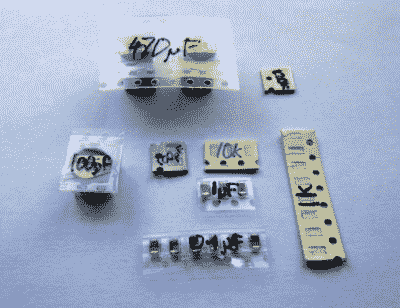
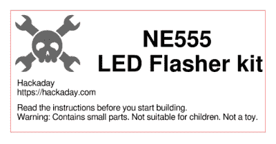
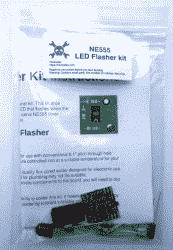

# 从项目到工具包:将所有内容整合在一起

> 原文：<https://hackaday.com/2016/08/19/from-project-to-kit-bringing-it-all-together/>

这是一个系列的第四篇文章，研究将一个电子项目变成一个可销售的工具包的过程。我们已经[了解了您的套件将参与竞争的环境](http://hackaday.com/2016/07/29/from-project-to-kit-so-you-want-to-sell-electronic-kits/)，如何[将一次性项目转变为有成本且可重复的单元](http://hackaday.com/2016/08/05/from-project-to-kit-getting-the-hardware-right/)，以及[如何为您的套件编写说明](http://hackaday.com/2016/08/12/from-project-to-kit-instructions-are-everything/)以吸引您的客户再次购买。在这篇文章中，我们将把所有的线索汇集在一起，因为我们考虑在将它们推向市场之前将它们打包出售。

如果你在从项目到工具包的旅程中走了这么远，你现在会有一盒电子元件、一堆印刷说明书、一盒塑料袋、薄卡片盒或任何其他你为工具包选择的零售包装。您已经准备好开始填充套件。

## 都在演示里了

Label all your hard-to-identify components, your customers will appreciate it.

在包装套件时，您的首要任务是确保您的客户收到他们应该收到的所有组件，他们可以轻松识别每个组件，并且整个套件的展示非常吸引人，这样当他们第一次看到它时，就会邀请他们购买或制作它。这在您包装任何组件之前就开始了，您必须仔细地将每个组件准备成所需数量的单元，如果它们不容易识别，就给它们贴上标签。预先切割胶带上提供的任何部件，如果不容易辨认，则在胶带上写下零件号或零件值。如果不能在标签上写下它们的价值，你甚至可能不得不把一些难以识别的部件包装在单独的标签袋中，尽管这会产生小袋和标签的额外费用。一些制造商会坚持使用黑色胶带，在胶带上不会出现不可擦除的笔！

小心切割元件带，有时很容易损坏它们的引脚。始终从底部而不是从有可剥离膜的一侧剪下胶带，如有必要，小心地稍微弯曲胶带，为剪刀打开组件之间的间隙。

如果你从决定一次要装多少套工具开始，列出所有的工具组件，并按照我们描述的方式准备好每个组件的数量。然后拿出所需数量的包裹或袋子，检查清单上的每个组件，在开始下一个组件之前，用一个组件填满所有的袋子。到时候，你就会有一堆塞满东西的工具包，准备好接受它们的说明和标签。

下一步是折叠你的说明书，并把它放入工具包中。花一点时间考虑如何最吸引人地展示它。例如，对于包装在 click-seal 塑料袋中的套件，折叠活页是有意义的，这样就可以从前面看到完整套件的彩色照片。当你把它放在袋子里的时候，确保 PCB 在它的前面从上到下是可见的。一位顾客在看你的工具包时，想立刻看到他们可能用它创造出什么。

现在你可以密封袋子或盒子了，工具包已经装好了。只需要给它贴上一个标签，上面有所有相关的信息，对客户有吸引力。除了最重要的特征——套件描述之外，您可能还想在标签上加上您的徽标或网址以及任何必要的小字体。我们已经放置了一个关于小零件和好奇儿童的警告，您也可以在这里放置任何注册或合规信息。例如在欧洲，你可能有一个 CE 标志和一个 WEEE 标志。一旦你将设计分类，你可以在你最喜欢的标签设计软件中运行它——我们使用了[gLabels](http://glabels.org/)——并在粘性标签上打印你想要的数量。我们强烈建议购买质量好的品牌标签，当你考虑到他们会有更可靠的胶水时，额外的钱是非常值得的，而且每个套件的额外成本将是微不足道的。选择一个合适的标签尺寸，在你的包装上填满适当的空间，易于阅读，而不是太大，我们使用 70 毫米 x 37mm 毫米的激光标签，其中 24 个可以放在一张纸上。

## 你的第一个成品

If Hackaday made electronic kits, they might look a little like this.

这是一个激动人心的时刻，当你将标签贴在你的第一个完整包装的套件上，第一次看到你的客户将会看到的东西:一个成品。但是你还没有完全完成，因为还有质量控制的小问题。从你的一批产品中随机抽取一两个，对照你的清单，把它们的内容都数出来。这将有助于您确保正确包装工具包。最后，给一个从未见过的朋友一个完整的工具包，并告诉他们将它作为质量控制的最后一部分。他们在各方面模拟您的客户，如果他们没有问题，那么购买该套件的任何人也不应该有问题。

一旦你建立了你的一批工具包，你现在就有你要发送给你的客户的股票。假设你是一名顾客，如果你订购了一套工具，你会希望它完好无损地到达。因此，您现在应该保管好这些套件，以确保它们不会受到任何伤害，当您寄出时，它们的包装与包装时一样干净、崭新，并且在储存时不会吸附任何灰尘。我们建议为你的产品系列中的每件套装准备一个单独的塑料盒，用盖子保护套装免受灰尘，或者将它们存放在一个更大的塑料袋中。

在我们完成这一系列文章的过程中，我们试图向您展示将电子工具包从个人项目带给大众的过程。我们已经了解了您的工具包的市场，我们已经讨论了在编写最佳说明之前将项目转化为产品，现在正在准备销售您的第一批工具包。在本系列的下一篇文章中，我们将讨论如何销售你的产品，网上商店、市场和众筹的不同选择。