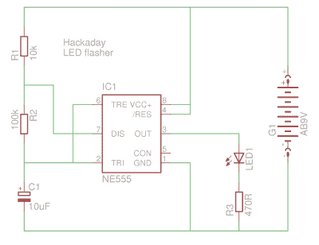
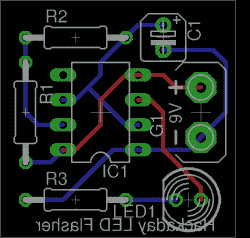
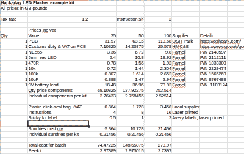

# 从项目到工具包:获得正确的硬件

> 原文：<https://hackaday.com/2016/08/05/from-project-to-kit-getting-the-hardware-right/>

在本系列关于将个人电子项目变成可销售套件的[上一篇文章](https://hackaday.com/2016/07/29/from-project-to-kit-so-you-want-to-sell-electronic-kits/)中，我们着眼于新进入者的套件市场的更广阔图景，评估您提议的套件是否有可行的定位并确保它具有可构建性、说明和质量的良好组合的重要性。在这篇文章中，我们将看看指定和定价的硬件方面的一套工具，详细说明了一个例子项目。我们选择的项目是一个简单的 NE555 LED 闪光灯，我们还没有建立，也没有打算组装成一个真正的套件，但是它提供了一个方便的参考项目，而电路本身没有任何特殊的考虑，可能会分散手头的工作。

## 细节，细节

Our LED flasher example project. Build at your own risk.

已经决定你手上有一个潜在的产品，你的下一步是把它从一个项目变成一个客户会满意的东西。如果你还没有这样做，你应该试着制作一个原型，它将准确地代表你将要销售的产品。鉴于你已经将它作为一个项目来运作，这看起来似乎是一件奇怪的事情，以不必要的重复努力开始，然而这里的关键点是，你应该使用你将出售的*确切的*组件。

你应该设计一个 PCB 并制造一个原型，你应该编写一份详细的材料清单，包括制造商或供应商的零件号，然后你应该像组装一批套件一样订购。的确，例如，从您的废品箱中取出的一个 10 K 电阻可能与供应商提供的新电阻一样好，但这里的要点是准确复制您的客户将收到的电阻。您应该注意工作电压、电阻的功耗数字，尽管目前您不太可能遇到许多含铅的元件，但您指定的任何产品都符合 RoHS 标准。

## 包装

The Hackaday LED flasher PCB

如果您可以使用这些组件构建几个原型，并且您很高兴您已经制作了一个可工作且可重复的套件，那么您应该以您将它发送给客户的方式包装一个示例套件。包括任何杂物，例如代表试剂盒说明的折叠纸和试剂盒包装的粘性标签。做出包装选择，例如是否应该用小纸箱或塑料袋寄出。你所在的城镇或城市应该有一个当地的散装包装专家，负责从珠宝店到外卖餐馆的各种服务，当你做出选择时，花一点时间在他们的陈列室看看有哪些选择。

在这一点上，你将不得不考虑你的组件的脆弱性，以及如何将它们发送给客户。例如，考虑您是否需要为任何 DIP ICs 提供支架。甚至走得更远，把一个样品订单装在一个有衬垫的信封里，称一下重量，看看它属于哪个邮政价格等级。您可能会在国际上销售这些套件，因此，无论哪种方式，几克就可以让您的邮资成本产生显著差异。

## 定价

一旦你对你的工具包包装满意了，拿起你的样品包，把里面的每样东西都列出来。不仅仅是电子元件，还有包装、标签、说明书和其他杂物。制作一个电子表格，并使用它来计算一系列生产规模的所有这些组成部分的价格。对于第一个工具包，它可能值得定价运行 25，50 和 100。研究供应商和价格折扣，如果适用的话，不要忘记包括任何销售税以及你可能需要进口的任何东西的关税。例如，如果你有一块中国制造的 PCB，这最后一点尤其重要。

Everything in our LED flasher example, itemised and priced.

我们为我们的 555 LED 闪光灯套件制作了这样一个电子表格。在我们的例子中，它是以 GB 磅为单位的，因为这是本文的写作目的，我们可以立即看到，当套件包装被考虑在内时，少量的 LED 闪光灯套件将花费我们不到 3 英镑。如果我们真的生产或大量生产这些套件，这一数字可能会通过数量价格折扣和更多的努力来寻找更便宜的来源而大幅下降，但是这只是一篇文章的示例套件产品，我们假设您的第一个套件不会有大量生产的奢侈。这是一个你必须做出的决定，要生产多少未经证实的套件，因为堆积如山的未售出套件可能意味着大量被占用的投资。从这个角度来看,“25 件套”似乎是正确的，如果它卖得出乎意料的快，你总是可以多买一些。

一旦你对你的工具包的生产成本有了一个准确的看法，你就可以考虑它们的零售价格了。您应该知道其他制造商对类似尺寸的套件的收费，这样您可能会知道应该将套件放在哪里，但是您必须认识到，生产和包装套件本身就是一项大量的工作，客户应该准备为此付费。你总会发现一个拥有计算器的客户抱怨他们刚刚为价值 2.50 英镑的组件支付了 5 英镑，然而，他们当然不只是为组件支付了费用，而是为创造令人满意的套件体验进行了开发工作。确保您的零售价格充分反映了生产该套件所花费的工作量，而不会超出界限太远，并且您的客户会理解他们为您的努力支付了部分费用。

## 后续步骤

现在你应该对你的工具包的硬件有一个清晰的概念:你将知道订购什么，它将花费多少，你将如何把它变成一个产品，以及它的零售价格。但是你还没有准备好把它推向市场，因为你还没有完成拼图游戏中最重要的部分之一。你的工具包还没有说明书，它的商业成功将取决于你随身携带的说明书。因此，本系列的下一篇文章将专门讨论这些说明，我们将带您了解为我们的 LED 闪光器示例套件编写一套说明的过程。