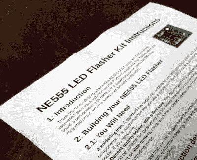
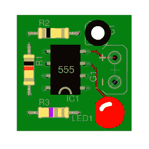
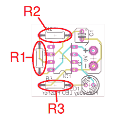

# 从项目到工具包:说明就是一切

> 原文：<https://hackaday.com/2016/08/12/from-project-to-kit-instructions-are-everything/>

A printed copy of the instructions for our example kit

在这个系列的前两篇文章中，我们讨论了如何将个人电子项目转变为可销售的套件，其中我们[在更广泛的背景下为新进入者考察了套件市场](http://hackaday.com/2016/07/29/from-project-to-kit-so-you-want-to-sell-electronic-kits/),并继续研究了组装制造产品所需的硬件的[过程。我们使用 NE555 LED 闪光器作为一个简单的例子，通过这个例子，我们完成了设定生产成本和零售价格的练习。](http://hackaday.com/2016/08/05/from-project-to-kit-getting-the-hardware-right/)

完成我们的套件生产所需的剩余任务是编写与之配套的文档。这些将是您的客户构建套件的指导，他们的成功以及他们可能向您推荐的任何其他客户都将取决于他们的质量。如此多原本完美无瑕的套件在这一部分出现了错误，因此对于套件制造商来说，这代表着一场轻松的胜利，需要付出一些努力。

## 保持简单

重要的是要记住，读者从来没有见过这个工具包，也不会有你的操作水平，所以你应该像一个相对的新手一样推销它们。想象一下，一个不太懂技术的人将要构建您的工具包，并试图为他们提供足够的信息，以便他们在不迷路的情况下继续进行。这有时看起来好像你把它推销得低得不可思议，但你的更懂技术的客户会理解并只拿走他们需要的东西。

我们已经为 NE555 LED 闪光器制作了一套样本说明，现在我们将逐一介绍。你可以[下载你自己的 Hackaday LED 闪光灯文档副本](https://hackaday.com/wp-content/uploads/2016/08/hackaday-led-flasher-documentation.pdf) (PDF)。如何撰写说明书取决于你，因为每个人都有自己的个人风格，所以这些说明书将代表一种特定的风格，可能与你心目中的风格不同。如果你以前从未写过试剂盒说明书，它们应该作为某种指导，你可能希望从中获得灵感。

## 部分

我们的 NE555 LED 闪光器说明书采用一套清晰描述的章节形式，介绍该套件，描述其操作，带用户浏览其组件，给出构建说明，最后描述其使用方法。我们现在将依次浏览每一部分。

A mockup of our 555 LED flasher

第一段是一个简短友好的介绍，并附有一张组装好的工具包的图片。除了说明该工具包的功能之外，它不需要做太多的工作，这只是一个介绍。在我们的情况下，图片是一个模型，这只是一个例子，为这一系列的文章，所以我们没有作出任何董事会。

在介绍之后，我们写了一节描述所需的工具和技术。在这种情况下，它是一段非常短的文本，因为不需要特殊的技术，但如果您的套件有表面贴装元件，您可能希望在这里扩展。重要的是要记住，一些用户可能没有遇到所有需要的技能，你的工作是让他们为他们可能遇到的任何事情做好准备。

技术部分结束了，我们继续讨论组件。一些套件制造商在这里制作了一个清单表，但这是一个简单的套件，所以我们描述了那些可能难以识别的组件。您可能希望采用两种方法的混合。

An example component placement diagram

一旦用户能够识别所有的东西，我们就一步一步地进行构建。这个进度应该基于你构建原型的经验，你应该记下最适合你的进度。在每个步骤中放入三到五个组件，并附上显示它们位置的图表。您会注意到，为了便于描述，我们的说明书中有三频段电阻，很可能真正的套件会带有五频段元件。

用户现在应该有一个完整的工具包。下一节将带他们完成任何必要的设置、故障查找或故障排除，以确保套件准备好通电。在这种情况下，它是一个很短的部分，因为 555 LED 闪光灯是一个非常简单的电路，但你可能会包括电压和电流，以便在连接计算机外设之前用万用表测量。

接下来的一节将详细介绍如何使用该工具包。对于 LED 闪光器来说非常短，但是举例来说，你可以详细说明计算机外围设备套件可能需要的软件，或者更复杂的套件应该如何连接。

随着建设和运作的方式，所有剩下的都是附录。我们已经将电路图放在这里，但它当然可以放在文档的正文中。你可以在这里找到数值表，或者法律法规信息。

## 测试和审查

一旦你写好了说明书，你就必须保证工作的质量。请你的朋友校对它们，如果你能给他们一个工具包的样本，并在他们制作工具包时附上说明。准备好回应任何批评，想象校对者代表真正的客户。

完成文档后，重要的是你要以尽可能好的方式展示它。用彩色激光打印机在高质量的纸上打印，如果可以的话，使用双面打印。它们对试剂盒来说和其他成分一样重要，因此应相应对待。

如果您从一开始就关注了本系列，那么现在您应该能够了解您的套件将竞争的市场，将您的原型转变为更接近产品的东西，并为您的客户创建一套高质量的说明。在本系列的下一部分中，我们将把我们在这一部分和上一部分中创建的内容结合在一起，我们将检查套件包装和生产第一批作为产品销售的套件的过程，而不仅仅是作为原型。