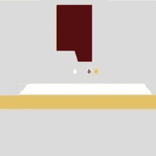
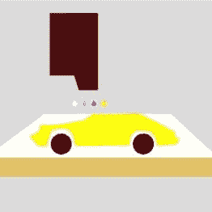

# 全彩色 3D 打印机升级将竞争对手远远甩在身后

> 原文：<https://hackaday.com/2016/08/18/full-color-3d-printer-upgrade-leaves-competition-in-the-dust/>

大多数 3D 打印机爱好者都是基于 FDM，挤出熔化塑料的单色面条来构建一个物体。基于粉末的喷墨 3D 打印允许您从类似石膏的材料打印详细的全色模型。该工艺使用从喷墨打印头分配的墨水和水滴来选择性地熔化和着色粉末状粘合剂材料层。当你看到一个 3D 打印的你(或其他人)的微缩版的报价时，它们是用粉末制成的。[Aad van der Geest]希望将这项技术应用到您的桌面上，配备有 [ColorPod](https://www.tindie.com/products/spitstec/colorpod-/) ，这是一个将您的 FDM 打印机转换为粉末打印机的套件。

在硬件方面，他的解决方案包括一个特殊的打印头(如标题图所示)，安装在 FDM 机器的挤出机喷嘴旁边。打印头具有粉末分配机制和两个现成的惠普喷墨墨盒。其中一个含有水，另一个可以用来给印刷品上色。粉末分配器使用一个寻呼机电机来喷洒聚乙烯醇粉末的精细层，而旋转辊使它们均匀。

  The dispenser and roller lay down the powder.  An inkjet head fuses the layers.  Object forms in the heap.

不同于工业机器(以及 1998 年[Aad]制造的那台)，工业机器在一个封闭的、类似活塞的构建空间中打印物体，[Aad]的 addon 只是在它放在构建板上的粉末堆中打印物体。[Aad]提供 PC 软件，将 STL 和 OBJ 格式的 3D 模型处理成可打印的 g 代码，并将指令传输到打印机和插件。它还在模型周围生成支撑墙以稳定粉末堆。

      

随着硬件的工作，[Aad]现在以 488 美元出售他的[附加套件(PCB 349 美元，套件其余部分 139 美元)。看看市场上可买到的粉床替代品，[Aad]的桌面解决方案比竞争对手低了大约 5 万美元。这当然不是一个成熟的产品，PVA 的灰尘和探索的善意为](https://www.tindie.com/stores/spitstec/)[的成功](http://www.vouwbad.nl/colorpod/build/index.html)铺平了道路，但【Aad 的】[的结果](http://www.vouwbad.nl/podpictures/)不言自明。他成功了，他也为我们提供了同样的工具。请观看下面的视频，其中[Aad]展示了 Ultimaker 2 上的工作套件。

 [https://www.youtube.com/embed/l5C7zb9_64g?version=3&rel=1&showsearch=0&showinfo=1&iv_load_policy=1&fs=1&hl=en-US&autohide=2&wmode=transparent](https://www.youtube.com/embed/l5C7zb9_64g?version=3&rel=1&showsearch=0&showinfo=1&iv_load_policy=1&fs=1&hl=en-US&autohide=2&wmode=transparent)

