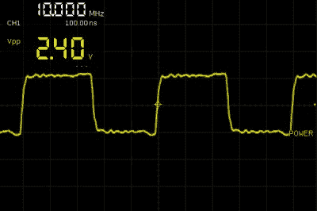

# 函数发生器获得 DIY 频率标准

> 原文：<https://hackaday.com/2018/04/08/function-generator-gets-diy-frequency-standard/>

对于我们这些喜欢不时争论电子的人来说，有一些低成本(或至少低成本)进口测试设备的特别交易。如果你愿意花几百美元，你可以买到一些十年前业余爱好者根本买不到的重要硬件。现在你可以以低于新 Xbox 的价格订购一台四通道示波器；但是哪一个你会花更多的时间盯着下巴松弛的人看取决于你。

10 MHz output from DIY frequency standard

当然，这些“便宜”的设备并不总是完美的。[Paul Lutus]对他相对便宜的 Siglent SDG 1025 任意函数发生器非常满意，但发现它的精确度有点不足。幸运的是，函数发生器接受一个外部时钟，可以用来提高它的精度，[，所以他决定建立一个](https://arachnoid.com/frequency_standard/)。

[保罗]首先回顾了他为这个项目考虑的不同选项，本质上归结为他是否想跳过恒温晶体振荡器(OCXO)所需的额外环节。但当他第一次尝试使用更简单的温度控制振荡器时，由于对封装尺寸的错误判断而失败，这一决定实际上是为他做出的。

最终，他决定购买 OCXO，并能够使用 SDG 1025 前面板上的 USB 端口为晶体预热和保持工作温度提供必要的电源。当他给振荡器通电后，他只需要把它放在一个合适的金属外壳中(以减少外部干扰)并校准它。[保罗]巧妙地利用 NIST WWV 广播和他的耳朵找到他的频率标准重叠的来源，因此验证它是在 10 兆赫。

[黑客喜欢精确](https://hackaday.com/2018/01/17/confessions-of-a-reformed-frequency-standard-nut/)，因此，我们已经看到了大量的频率标准构建，从极其便宜的到奢华过度的。