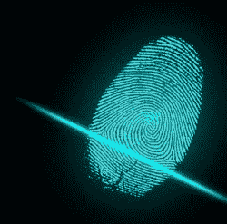
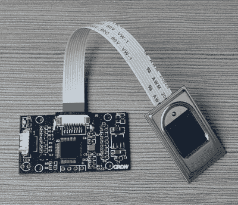

# 指纹扫描的基础

> 原文：<https://hackaday.com/2017/04/27/fundamentals-of-fingerprint-scanning/>

像大多数(如果不是全部)Hackaday 读者一样，我想知道我使用的技术是如何工作的。例如，我总是很惊讶，除了“这是一台收音机”之外，有多少聪明人不知道手机网络是如何工作的。所以现在我有了两部装有指纹扫描仪的手机，我决定我需要更多地了解那里发生了什么。

 当然，我假设传感器是电容性的(但也许不是，我发现了)。再加上我们都知道一些[强力胶，透明胶带，和小熊软糖](https://hackaday.com/2015/11/10/your-unhashable-fingerprints-secure-nothing/)都是你需要伪造出来的。然而，人们知道这一点已经有 15 年了，我们仍然看到手机和其他设备推出了相同的扫描仪。所以现在，先把关于我们是否应该使用指纹扫描仪的争论放在一边。让我们来谈谈这些传感器是如何工作的。

## 三项技术

至少有三种常见的指纹扫描方式:拍照、电容感应或超声波感应。不管你怎么做，你最终都会得到一个印刷品的图像。然后从图像中，你必须判断出这是不是右手手指。

## 视觉的

 说得通，你可以用类似相机的设备拍下指纹的照片。事实上，我见过这种方法被用来做指纹鉴定。最近的三星 Galaxy S8+在手机屏幕下使用了一个光学传感器。这显然是为 Galaxy S8 计划的，但由于技术问题，在最后一刻被取消。然而，一些光学传感器很容易被手指的照片蒙骗，脏手指也会引起问题。一些传感器使用第二种方法来检测活体手指，例如检测脉搏或体温。

## 电容

R306 Capacitive Fingerprint sensors found on [Ali Express](https://www.aliexpress.com/item/R306-Capacitive-Fingerprint-Reader-Module-Sensor-Scanner/32607084262.html)

电容式指纹传感器——大多数手机中的那种——有两种工作方式:主动或被动。无论哪种方式，每个传感器元件都像一个电容器。对于被动扫描，你的手指形成每个电容器的另一个极板。在主动扫描中，传感器有两个极板，手指会改变预期电容。

无论哪种方式，这些都很便宜而且相当坚固。唯一的问题是，你的手指必须与硅传感器紧密接触，如果你的手指上有静电，这可能会导致问题。要求人们戴上腕带解锁手机是不现实的，所以传感器需要特殊的结构来帮助他们处理静电引起的高电压。

## 超声

一些最新的手机使用超声波来感应你手指的真皮层，它也有指纹纹。这些没有污垢的问题，即使你手指上的伤疤也不会阻止它识别你。它甚至不太容易受到假手指欺骗，但时间会证明这是真的还是假的。

## 请出示证件

 这样一来，你就有了指纹的位图图像。现在怎么办？显然，有三种类型的指纹图案:拱形、环状和螺旋形。足弓就像它听起来的那样，从手指的一边开始，延伸到另一边。循环折回并从开始的同一侧退出。螺纹围绕一个中心点旋转。有趣的是，家庭成员通常有相似的指纹图案，但即使是同卵双胞胎也没有完全相同的指纹。

匹配指纹有几种算法，但最常用的是细节匹配算法。这着眼于三件事:你的脊结束的地方，非常短的脊，和脊分成两部分的地方。基于这些，有足够的信息将你的指纹与大多数其他人的区分开来。如果你想尝试自己的实现，你可以找一篇简短的学术论文来描述这个过程。或者，如果你搜索一下， [GitHub](https://github.com/ethiery/FuFengprint-Matcher) 有多种变体，有些是基于后来的论文。

当然，这个算法并不是万无一失的。但是，有人试图随机解锁你的手机有相同的模式的几率相当低。例如，谷歌的指导方针称扫描仪的误报率不能超过 0.002%。如果有 50，000 人试图解锁你的手机，那么，你可以期待其中一人会进入。当然，如果进入的是 5 万人中的第一个…如果发生这种情况，也许你应该买张彩票。

## 给你的手机竖起手指

简而言之，这就是指纹扫描仪的工作原理。就像我说的，如果你下定决心，伪造一个传感器并不难(见下面的视频)，所以也许你不应该把你的银行密码锁在你的指纹后面。

尽管如此，我们已经看到指纹[打开车库门](https://hackaday.com/2016/03/16/fingerprint-garage-door-wont-open-every-time-a-neighbor-microwaves-a-burrito/)，你可以找到 [USB 扫描仪](https://hackaday.com/2016/01/29/fingerprint-scanner-for-laptop-and-raspberry-pi-or-giving-the-finger-to-your-computer/)，它将与树莓派一起工作，如果你还想使用这项技术的话。

当然，你会想为什么我们会有指纹，或者为什么它们只是在我们的手指上。科学家不知道，但他们已经推翻了旧的观念，即它帮助我们更好地抓地力。

[https://player.vimeo.com/video/75324765](https://player.vimeo.com/video/75324765)