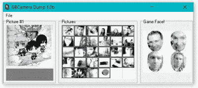

# 游戏男孩相机墨盒颠倒，照片倾倒

> 原文：<https://hackaday.com/2016/03/08/game-boy-camera-cartridge-reversed-photos-dumped/>

在这个每个手机都有百万像素的时代，极低的分辨率有一种神奇和怀旧的感觉。Game Boy 的大型球形摄像头模块看起来太酷了。[罗布森·库托]并没有停留在简单地使用摄像头上——这在以前已经有人做过了——而是实际上[逆转了卡片的协议，这样他就可以让它完全完好无损](http://dragaosemchama.com/2016/02/downloading-game-boy-camera-pics/)。从横幅图片可以看出，这是一次成功。

像这样的项目不是一夜之间就能完成的，而且[罗布森]借鉴了他自己以及其他人的大量工作成果。例如，他已经[制作了一个通过 ATmega32 和串口将 Game Boy Paks 连接到他的 PC](http://dragaosemchama.com/2015/11/gameboy-paks-to-pc-interface-board/) 的主板。他还[编写了理解 PC 端卡片标题格式的软件](http://dragaosemchama.com/2015/12/gameboy-pak-reader-cartridge-header/)。所以转储 rom 内容应该没有问题。但是当然，它是。

[罗布森]可以读取一个内存库，但不能读取任何其他的。事实证明，相机包使用的时钟信号不是很多其他卡使用的。(罗布森)做了一些认真的工作——很多都是错误的开始和死胡同——让这个特殊的部分工作起来。

Success!

如果你对 Game Boy hacking 感兴趣，请好好读一读[Robson]的文章。还要注意的是，在他所有的帖子中，都有与之前研究的精彩链接。如果你不在乎保持墨盒完整，你可以简单地[将相机与 TI 计算器](http://hackaday.com/2014/11/29/articam-interfaces-game-boy-camera-with-ti-calculators/)连接，[使用相机传输莫尔斯电码](http://hackaday.com/2012/12/10/morse-code-transceiver-based-on-gameboy-color-camera/)，或者简单地[为风格](http://hackaday.com/2015/04/03/8-bit-digital-photo-gun/)的低分辨率即时相机添加热敏打印机。