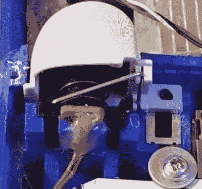

# 使用 GameCube Advance SP 实现便携性

> 原文：<https://hackaday.com/2017/05/27/gamecube-advance-sp/>

从一开始，我们就喜欢便携式游戏机。需要说明的是，我们并不仅仅指 3DS 或 RetroPie builds 之类的手持设备，而是指当一个制造商从过去几代人那里得到一台家用游戏机，并把童年的幻想变成现实——这就是爱。所以，[比尔·帕克斯顿]的 GameCube 被重新想象成[Game Boy Advance SP](https://bitbuilt.net/forums/index.php?threads/gamecube-advance-sp-gca-sp.1338/)让我们着迷是很自然的。【T2

最初的灵感来自于 2000 年初[想象的“下一代”游戏机 Advance](http://img.photobucket.com/albums/v483/wizkid007/portable_cube_open.jpg) 的模型，【Paxton】第一次尝试在这个模型中嵌入 Wii 磁盘驱动器。发现它有点太笨重，他选择使用 WASP Fusion 板运行 SD 卡上的游戏。将控制器按钮集成到 3D 打印的外壳中需要几次修改。看看需要包括 L 和 R 肩按钮的精确建模，这不是一个小壮举。

遗憾的是，这款 GameCube SP 没有内置电池，所以你不能带着 Windwaker 到处走。然而，它包括一个 15 针迷你 din VGA 风格的端口，用于将游戏保存复制到内部存储卡，一个开关耳机插孔，放大器和扬声器。休息之后来看看吧！

 [https://www.youtube.com/embed/Yp6-alEwGbM?version=3&rel=1&showsearch=0&showinfo=1&iv_load_policy=1&fs=1&hl=en-US&autohide=2&wmode=transparent](https://www.youtube.com/embed/Yp6-alEwGbM?version=3&rel=1&showsearch=0&showinfo=1&iv_load_policy=1&fs=1&hl=en-US&autohide=2&wmode=transparent)

在你高呼“任天堂 Switch 第一个做到了”之前，请记住，制造商们已经这样做了[年](http://hackaday.com/2014/04/07/vacuum-formed-portable-n64-is-the-real-deal/)、[年](http://hackaday.com/2011/07/29/sleek-disc-less-gamecube-handheld/)、[年](http://hackaday.com/2010/03/14/flip-top-gamecube-portable/)。让他们继续前进！