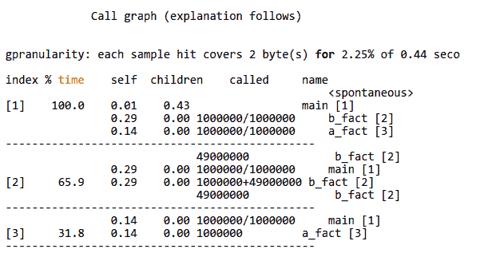

# Gcc:需要一些组件

> 原文：<https://hackaday.com/2016/06/08/gcc-some-assembly-required/>

曾经有一段时间，你必须是一个汇编语言程序员才能使用嵌入式系统。是的，一直以来都有高级语言可用，但是这需要工具和处理器的改进才能让除了最简单的项目之外的任何事情都有意义。然而今天，许多语言都有高质量的编译器，即使是廉价的 CPU 也可能比我们许多人使用的台式电脑性能更好。

所以汇编语言已经死了，对吧？不完全是。人们仍然想使用汇编语言有几个原因。首先，有时你需要从芯片中获得每个时钟周期的性能。情况可能是，一个聪明的编译器通常会产生比一个人即兴编写的代码更好的代码。然而，一个关注性能的聪明人通常能够找到击败编译器生成的代码的方法。此外，人们可以进行速度和空间的价值交易，或者选择完全不同的算法。编译器所能做的就是尽可能聪明地转换你的代码。

除此之外，有的人就是喜欢汇编编程。莫尔斯电码、弓箭和蒸汽机都是过时的，但仍然有人喜欢掌握它们。如果你属于这一类，你可能只想用汇编写所有的东西(这很好)。然而，大多数人更喜欢在更高的层次上工作，然后只对关键部分进行汇编。例如，一个程序可能花 5%的时间读数据，5%的时间写数据，90%的时间处理数据。您可能不需要重新创建读写部分。毕竟，它们不会变为零，所以即使你能把它们减半(你可能做不到)，你也能从每一项中获得 2.5%的增长。那 90%的部分才是大目标。

## 侧写员

有时很明显你的程序中什么在耗费时间。如果不是，您实际上可以打开分析。例如，如果您在 Linux 下运行 GCC，您可以使用`-pg`选项让 GCC 自动向您的代码添加分析工具。当你用`-pg`编译代码时，它看起来并没有什么不同。你照常运行你的程序。然而，程序现在会在执行过程中悄悄写一个名为`gmon.out`的文件。该文件包含可以使用`gprof`显示的执行统计数据(参见下面的部分输出)。函数`b_fact`占用了 65.9%的 CPU 时间。

[](https://hackaday.com/wp-content/uploads/2016/05/screenshot_232.png)

如果您没有针对您的环境的分析选项，您可能不得不求助于切换 I/O 引脚或写入串行端口来了解您的代码执行不同的功能需要多长时间。但是，无论您如何做，重要的是要弄清楚它，这样您就不会浪费时间来优化不会真正影响整体性能的代码(顺便说一下，这对于任何类型的优化都是一个好建议)。

## 装配

如果你从一个 C 或 C++程序开始，你可以做的一件事就是让编译器为你输出汇编语言。对于 GCC，使用类似于`test.s`的文件名和`-o`选项，然后使用`-S`强制汇编语言输出。输出不是很好，但是是可读的。您还可以使用`-ahl`选项在注释中获得与源代码混合的汇编代码，这很有用。

您可以在大多数(如果不是所有)版本的 GCC 中使用这个技巧。当然，输出会有很大不同，这取决于。32 位 Linux 编译器、64 位 Linux 编译器、Raspberry Pi 编译器和 Arduino 编译器都会有非常不同的输出。此外，你不能总是弄清楚编译器是如何破坏你的代码的，所以这是另一个问题。

如果你发现一个函数或者一段代码需要重写，你仍然可以使用 GCC，只需要内嵌汇编语言。具体如何工作取决于您使用的平台，但一般来说，GCC 会将一个包含在`asm()`或`__asm__()`中的字符串发送给系统汇编器。关于如何与 C 程序的其余部分交互也有规则。这里有一个来自 [GCC HOWTO 文档](https://www.ibiblio.org/gferg/ldp/GCC-Inline-Assembly-HOWTO.html)的简单例子(来自 PC 程序):

```
__asm__ ("movl %eax, %ebx\n\t"
"movl $56, %esi\n\t"
"movl %ecx, $label(%edx,%ebx,$4)\n\t"
"movb %ah, (%ebx)");
```

您还可以使用扩展汇编，它允许您为 C 代码的某些部分使用占位符。你可以在 [HOWTO 文档](https://www.ibiblio.org/gferg/ldp/GCC-Inline-Assembly-HOWTO.html)中了解更多信息。如果你喜欢 Arduino，也有一个用于那个的[文档。如果你在 ARM 上(像一个树莓 Pi)，你可能更喜欢从](http://www.nongnu.org/avr-libc/user-manual/inline_asm.html)[这个文档](http://www.ethernut.de/en/documents/arm-inline-asm.html)开始。

## 那又怎样？

你可能永远不需要混合汇编语言和 C 代码。但是如果你这样做了，很高兴知道这是可能的，甚至可能不会太难。您确实需要找到您的程序的哪些部分可以从中受益。即使你没有使用 GCC，也可能有一种方法可以将汇编和你的语言结合起来，你只需要学会如何去做。你还必须了解你的平台的细节。

另一方面，如果你想用汇编写一个完整的程序呢？这甚至更多是特定于平台的，但我们将在下一次讨论这个问题。