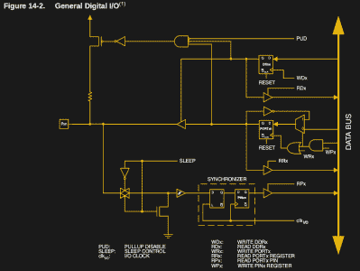
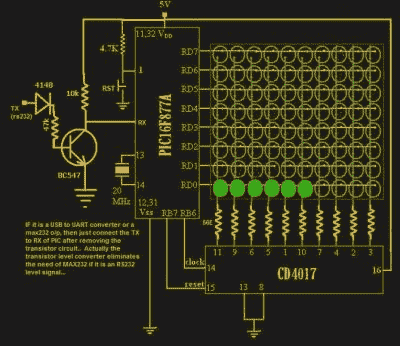
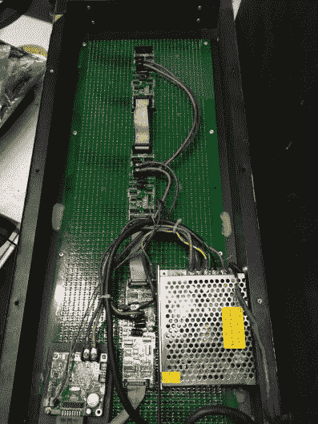
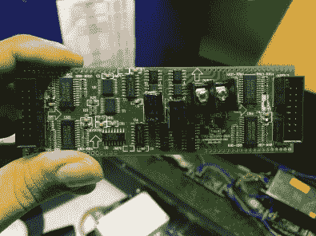
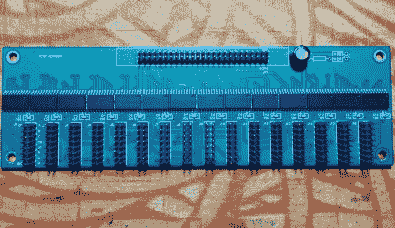
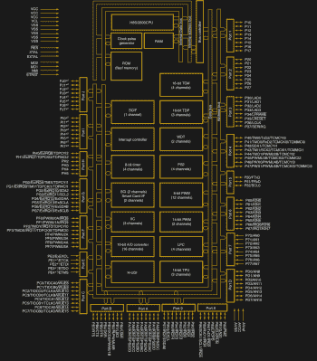

# 通用 I/O:如何获得更多

> 原文：<https://hackaday.com/2018/06/14/general-purpose-i-o-how-to-get-more/>

人们为微控制器编写的第一个程序是闪烁的 LED，它涉及通用输入/输出(GPIO)的开关。因此，同样的 GPIO 也可以用来读取数字位。像 8051 这样的传统微控制器提供 20 引脚到 40 引脚的 DIP 封装。有些器件用 gpio 的数量来换取紧凑性，而其他器件提供更多的 gpio，代价是在设计中增加器件的复杂性。在本文中，我们快速浏览一下需要大量 GPIOs 和传统解决方案的应用程序。

GPIO 是集成电路或计算机板上的通用引脚，其行为(包括它是输入还是输出引脚)在运行时可由用户控制。请参考 ATmega328 的 GPIO 电路内部图。

简而言之，每个 GPIO 都有一个锁存器连接到驱动电路，晶体管用于输出部分，另一个锁存器用于输入部分。在 ATmega328 的情况下，还有一个方向寄存器，而在 8051 的情况下，输出寄存器用作方向寄存器，向其写入 1 会将其设置为输出模式。

这里需要注意的重要一点是，由于所有电路都在同一块硅片上，所以运算速度相对较快。将所有锁存器和寄存器放在同一条总线上意味着只需一条指令就可以从任何 GPIO 寄存器中写入或读取一个字节。

## 什么时候需要更多的 GPIOs？

 你可能需要大量 GPIOs 做什么？再来说说 LED 标志牌。如果您想要直接驱动每个 LED，即使是 32 x 32 像素这样的小尺寸也至少需要 1，1,024 GPIOs。RGB LEDs 实际上是三个 led，这意味着 IO 需求的三倍。现在想象一下驱动足够多的这些面板来填满一面墙。显然，这需要简化。

还有一些应用需要读取位，例如键盘。在 Hackaday 贝尔格莱德徽章的情况下，键盘有 55 个按钮，但你可以想象 101 个按钮的键盘的复杂性。我最近做了一个项目，需要同时读取 120 个数字传感器，而可用的 PCB 空间非常有限。

那我们怎么去呢？有许多方法可以扩展 GPIOs 数，尽管有些应用不需要专用 I/o。重要的是理解每种方法的优缺点，找到最适合你下一个项目的方法。

### 矩阵扫描

 矩阵扫描涉及使用多路复用器来“模拟”大量的 I/o。矩阵扫描的一个好例子是 LED 点阵。人类视觉的持久性会使其看起来好像所有的发光二极管都比实际点亮了更长的时间。这种排列被称为“扫描”显示器，因为 led 一次照亮一列，并且一行中的所有 led 的阴极都连接到单个 IO。

当然，这些列可以由 GPIO 引脚驱动，但由于它们只是一次通过一个列，因此将它们连接到计数器芯片的输出通常是有意义的，比如说 CD4017，如果只有 10 列。对于每一列，微控制器打开相关的 I/O 以显示模式，然后为计数器计时以选择下一列，之后重复该过程。

矩阵扫描键盘也可以用同样的方法制作，将 GPIO 引脚设置为输入模式。随着每列被拉高，行上的 GPIOs 可以检测到该列中的哪些按钮被按下。为了准确检测多次按压，[每个按钮需要一个二极管](https://learn.sparkfun.com/tutorials/button-pad-hookup-guide)。

矩阵扫描可能是满足中等规模 GPIO 需求的简单解决方案，但它也有其局限性。再次以驱动 32×32 的 led 阵列为例:它至少需要 32 个行，外加一个时钟和复位来驱动列的外部计数器。许多行仅仅意味着许多 GPIOs。列越多，每个像素刷新的时间间隔就越长。但是，众所周知，剥猫皮的方法不止一种。

### 移位寄存器

向微控制器添加 I/O 的一个简单方法是使用移位寄存器。像 74HC595 和 74HC4094 这样的芯片[通常用于增加输出](https://learn.adafruit.com/adafruit-arduino-lesson-4-eight-leds/the-74hc595-shift-register)。在输入方面，CD4021BC 和 SN74HC165N 都是经典芯片，网上自然有两者的教程: [Arduino 的 4021 教程](https://www.arduino.cc/en/Tutorial/ShiftIn)和 [Adafruit 的 HC165N 教程](https://playground.arduino.cc/Code/ShiftRegSN74HC165N)。

[SPI 总线](https://hackaday.com/2016/07/01/what-could-go-wrong-spi/)的工作方式本质上类似于移位寄存器，或者相反，移位寄存器可以由微控制器的板载 SPI 硬件轻松驱动。这意味着时钟和数据移位可以使用专用硬件外设来完成，而不是上面所示的 bit bang 软件例程。

  The back of a LED Display  The “Hub Card”  Another Hub card from a different model

回想一下我们上面关于矩阵扫描驱动 led 的讨论。GPIO 引脚的数量随着行数的增加而增加。对行使用移位寄存器将显著减轻 GPIO 负担。市场上的 LED 矩阵面板采用移位寄存器来读取行数据，这也许并不奇怪。额外的好处是，链接行移位寄存器允许面板简单地连接在一起。

如果你想显示动画，这意味着有必要在它们之间足够快地移动数据，以达到特定的帧速率。上图显示了这样一个矩阵显示器，它使用 TLC5958 等效器件作为数据元素。74HC245 用作驱动元件，74HC138 用作地址线的解码器。查看此 TI 应用笔记了解更多详情 (PDF)。

多路复用器和移位寄存器为控制器增加引脚提供了一个优雅的解决方案。菊花链移位寄存器不仅可以简化 PCB 布线，还可以降低信号间偏斜和抖动，因为所有锁存器都由相同的输出使能信号控制。缺点是，要读取或写入最远的芯片，数据必须循环通过链中的所有芯片。任何使用过链式 LED 驱动器 P9813 或更著名的 WS2812 的人都知道，通过串行线路发送每个 LED 的 24 位颜色数据会带来明显的延迟。

(旁注:我还在我们办公室的一台旧 DVR 里发现了类似的芯片。有人在旧设备中找到类似的有用芯片吗？)

### 其他 IO 扩展器芯片

基于 SPI 和 I2C 的 IO 扩展器是向低成本微控制器添加 I/O 的另一种方法。微芯片 MCP23S17 和 MCP23017 是受欢迎的选项，可以像本地 GPIO 一样配置为输出或输入。此外，这些芯片提供中断等功能，当配置为输入端口时，这些功能会派上用场。

然而，这种装置并非没有缺点，因为扩张器的成本可能是一项开销。还有，这些芯片没有 74HC595 移位寄存器便宜，也没有片内 GPIO 快。它们通常也是针对中等规模的 IO 问题。

### 微控制器

当您需要更多 GPIO 引脚时，另一种可能性是简单地使用更多微控制器。这种方法更像是设计子模块:例如，使用一个专用的微控制器来控制键盘，使用另一个微控制器来控制显示器，甚至是显示器的一部分。模块化有助于缩短上市时间，是许多产品的典型特征，如数字电源、示波器等。最后，所有的子处理器都必须与控制整个系统的主处理器通信。

 堆积子系统可能快速灵活，但多个微处理器的成本和所需的 PCB 空间可能对某些项目不起作用。相对于使用具有高 I/O 引脚数的单个微控制器的成本，考虑这一成本是值得的。Renesas 的 DF2117VBG20V 等控制器采用 176 引脚 LFBGA 封装，具有 128 个 I/o。(哇！)问题在于，即使在四层板上，PCB 的复杂性也可能是布线的噩梦，而且所需的小特征尺寸也使组装和测试变得复杂。

FPGAs 和 CPLDs 可能是高 IO 数应用的“首选解决方案”。用 Verilog/VHDL 编写完整的项目总是一件艰难的工作，但是软件处理器的采用使事情变得容易了很多。FPGAs 也可能更贵一点，添加配置 EEPROM 并不会使事情变得更容易。这就是 CPLDs 的闪光点。

## 你从这里去哪里？

设计方法的选择在很大程度上取决于应用。今天，几乎所有你能想到的东西都有专用芯片。然而，总是有机会找到一个有古怪要求的客户。业余爱好项目的约束明显不同于数千件商业产品的约束。

当你需要很多 GPIOs 的时候你会怎么做？这些解决方案的具体优点和缺点是什么？我们很想听听他们的故事。