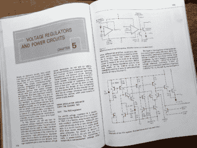
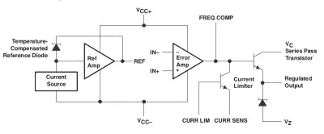
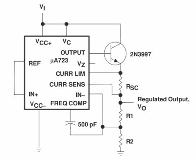
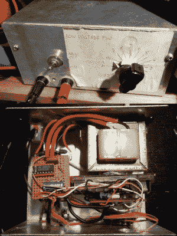

# 用 723 了解电压调节器

> 原文：<https://hackaday.com/2016/12/02/get-to-know-voltage-regulators-with-a-723/>

“第五章；霍洛维茨和希尔”。所有学科的大学生都有自己的标准课本，每个人都有一本。这本书对他们来说太熟悉了，以至于被作者称为速记，根据主题和所讨论的大部头，这本书要么被普遍厌恶，要么被当作终生的参考书而珍藏。

对于电子工程师来说，最能体现这一点的作品是[保罗·霍洛维茨]和[温菲尔德·希尔]的*的《电子艺术》。它无疑属于后一类教科书，既是一座信息宝库，又以极其通俗易懂的风格呈现。现在已经有了第三版，但我面前的这本书是 20 世纪 80 年代中期印刷的第一版。*

*

*The Art of Electronics*, on regulators.

第 5 章可能给十几岁的我留下了最深刻的印象，因为它解释了线性和开关电源的电压调节和电源。虽然从经验的角度来看，电源并没有什么特别的挑战性，但作为一个 19 岁的孩子，用一本有意义的书来解释它们，因为它告诉你所有你需要知道的东西，而不仅仅是学校考试大纲要求你应该知道的东西，这是一种启示。

在我的 *Art of Electronics* 第 5 章的第一页，他们直接进入μA723 线性稳压器。这是相当古老的；模拟集成电路大师、传奇人物[ [鲍勃·威德拉](https://en.wikipedia.org/wiki/Bob_Widlar)的设计，于 1967 年首次推向市场。[Horowitz]和[Hill]说“*虽然现在你可能不会选择它作为新的设计，但它值得仔细研究一下，因为最近的监管机构也在用同样的原理工作*”。当他们写下这句话时，它已经 13 岁了，现在它已经将近 50 岁了，然而从德州仪器仍然将它列为活跃产品的事实来看，没有任何关于生命终结的不祥警告，似乎许多设计师都没有注意到这些话。

那么，为什么一个 50 岁的调节器芯片仍然是一个活跃的产品？有大量更好的监管机构，可能是更便宜、更高效的监管机构，这使得 14 针的下跌看起来确实非常过时。答案是，它是一个非常有用的部件，因为它并不为您提供调节器本身，而是一个包含几乎任何描述的调节器所需的所有部件的套件。因此，对于设计人员来说，它是一款用途极其广泛的设备，对于任何想要了解或尝试调节器的人来说，它也是一个理想的平台。

Block diagram of a 723 regulator. From [the TI data sheet](http://www.ti.com/lit/gpn/ua723).

贯穿整个封装内容，有一个温度补偿基准电压源、一个误差放大器、一个输出晶体管和一个电流检测晶体管，对于设计人员来说，它们几乎都是独立的元件。它可以配置为负或正电压串联调节器，可以使用外部晶体管来提高其 150mA 额定电流，可以集成限流器，可以是分流调节器，数据手册中甚至有一个电路可以用作开关调节器。要完全理解 723，就要完全理解低压线性稳压器。

The datasheet’s 723 supply with external pass transistor and current limit.

在我的工作台上有一个低压电源，它是我制作原型时的电池替代品。这是我多年前读完“电子技术电源”一章后使用 723 制作的电源，与器件数据手册图 4 所示的电路没有什么不同。

一个标准的变压器、桥式整流器和大电容器产生约 14 伏的未稳压电源。这是通过一个功率晶体管，其基极由 723 输出驱动，然后通过一个电流检测电阻到 PSU 输出和电流检测线。输出端跨接一个电位计，其游标连接到误差放大器的负输入端，而正输入端来自基准电压源。电位计的反馈设置输出电压，范围从 2 伏到 12 伏多一点。

The 723 PSU, inside and out. Suddenly I’m a kid again.

对我这个 19 岁的人来说，神奇的是我理解了电流限制器。检测电阻是一个 1 ohm 线绕元件，连接在电流检测晶体管的基极和发射极之间，因此当通过电阻的电流达到 600mA 时，电阻上的电压足以开启晶体管。这反过来会拉低输出晶体管的基极，并限制电压，使电流保持在 600mA 的限值。作为一个成年人简单明了，但作为一个菜鸟，这是一个所有事情都走到一起并有意义的灯泡时刻。

供应本身相当破旧，我的手写校准粘在行李标签贴在它的前面板上。盒子里面有点乱，一块条板上混合着二手元件和 723。几十年后，我会做得更好，但它一直很好地服务于我，毫无疑问会继续这样做。

我不知道其他工程师是否有最喜欢的集成电路，或者我是否是唯一一个意识到我会提名 723 为我的集成电路的人。这似乎是一个奇怪的选择，因为在我的职业生涯中，我并没有多次使用这个组件。但对我来说，一个能够提供如此多种功能的电路的优雅是有吸引力的，它以如此简单而巧妙的设计做到了这一点，这是我喜欢它的充分理由，即使我很少需要设计线性调节器。也许我应该在下一个订单中去掉一些，并探索它的其他配置。

谁知道呢，也许你也应该。*