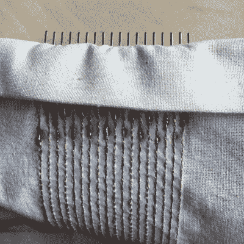

# 给你一个电子纺织品传感器，可以做到这两点

> 原文：<https://hackaday.com/2017/11/16/get-you-an-e-textiles-sensor-that-can-do-both/>

[Admar]是一名软件开发人员，2011 年开始接触电子纺织品。这种虫子牢牢地抓住了他，这些天他在埃因霍温科技大学举办了电子纺织品研讨会。在这里，学生学习构建一个单一的电子纺织品传感器，检测存在和压力。他的网站上有研讨会的介绍，这也是他电子纺织之旅的一个窗口。

 这些年来，【Admar】发现任何需要更多连接的电子纺织品项目都适合使用某种纺织品友好型多点连接器。[通过反复试验，他设计出了一种适用于刺绣机](https://www.instructables.com/id/Simple-E-textile-Connector/)的强大解决方案。导线由导电线制成，并焊接到一排插头引脚上，以实现光纤空间外的过渡。这种过渡需要焊料，当与织物衬底耦合且没有焊料掩模时，这很快变得有趣。我们想知道事先喷在面膜上是否会有帮助，或者它是否会渗透进去，弄脏并挡住去路。

休息之后，您可以在[Admar]的电容式多点触控演示视频中看到连接器的实际应用。他将两片织物叠放在一起，每片织物上都有一条由导电线制成的导线总线，迹线呈直角。两个传感器都连接到 Cypress PSoC5 以创建传感器矩阵，然后连接到笔记本电脑以实现可视化。当他的手指接近织物时，条形图向上轰鸣，显示电容增加。一旦他进行接触，每个手指都显示为一个黄点，表示压力。

电子纺织品项目不仅限于手工或刺绣机缝制的痕迹。[电路板也可以编织](https://hackaday.com/2014/06/19/knitted-circuit-board-lends-flexibility-to-e-textiles/)。

谢谢你的提示，[梅丽莎]！