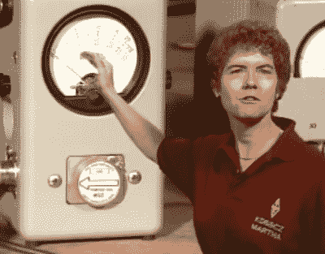

# 已经得到你的业余无线电执照！

> 原文：<https://hackaday.com/2016/01/05/get-your-amateur-radio-license-already/>

我们在 Hackaday 的业余电台上发布了很多帖子，我们的大多数作者和编辑*都是有执照的业余爱好者。为什么？因为摆弄无线电电子产品很有趣，也因为有了许可证，更多的实验就合法了。(*我们相信你有充分的理由懈怠，Szczys。)

所以，让我们说，你想得到你的“票”(你住在美国)。很简单:只需要准备一两次考试，然后参加考试。怎么学习？我们很高兴你问了这个问题，因为我们刚刚发现了这个令人难以置信的长视频，它将帮助你准备考试。

 在六个半小时的时间里，我们会承认我们没有看完整个节目，但是我们所看到的看起来棒极了。不可否认，我们对[约翰(KD65CY)]的过度热情感到有点不安。但是内容是基本的、广泛的和相关的。见鬼，甚至有点娱乐性。

即使你对考试不感兴趣，只是对一些无线电基础感兴趣，也值得一看。如果你尝试一下，并且喜欢你所看到的，请在评论中告诉我们你对哪些时代邮票感兴趣。

关于业余无线电考试的另一个“秘密”是，所有的问题和答案都是从公开的问题库中抽取的。这意味着你只需要死记硬背正确的答案，通过考试，你的灰色细胞马上就会恢复如新。为了帮助你，这里有[所有当前技术人员的问题，只有每个](http://ix.io/n8L)的正确答案。(这里是生成它们的 [Python 脚本](http://ix.io/n8B)。)通读一下这个，[参加几次模拟考试](http://arrlexamreview.appspot.com/)，你就准备好了。

根据我们的经验，技师考试非常简单，可能值得您为普通考试做准备。你必须先吃前者，后吃后者，但没有什么能阻止你一口气把它们都吃完。(通用能让你获得更多的国际短波频率，所以至少值得一试。)

但不要因此而放慢你的脚步。仅仅是获得技术执照就值得花上几个小时来学习。你现在没有借口了。去做吧！

 [https://www.youtube.com/embed/CPyidvTGJ9Y?version=3&rel=1&showsearch=0&showinfo=1&iv_load_policy=1&fs=1&hl=en-US&autohide=2&wmode=transparent](https://www.youtube.com/embed/CPyidvTGJ9Y?version=3&rel=1&showsearch=0&showinfo=1&iv_load_policy=1&fs=1&hl=en-US&autohide=2&wmode=transparent)

