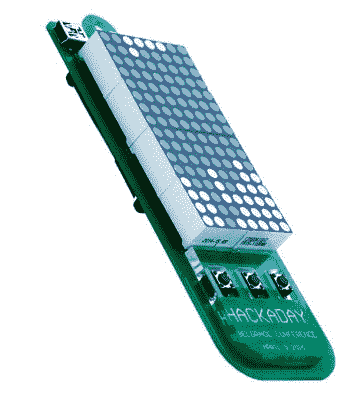

# 现在就买你的贝尔格莱德 Hackaday 门票吧

> 原文：<https://hackaday.com/2016/02/08/get-your-hackaday-belgrade-tickets-now/>

我们刚刚开放了 Hackaday | Belgrade—[4 月 9 日的硬件大会](https://hackaday.io/belgrade/)的注册。现在就买票，安排今年春天游览贝尔格莱德。机票不贵，欧洲其他地方的旅行费用非常合理，天气会很好，我们计划的全天疯狂会让你希望是一周而不是仅仅 16 个小时。这些票会卖光，所以请与你的朋友分享这篇文章，这样他们就不会没有票了。

### 挤满了了不起的人

If you don’t recognize the name you will almost certainly recognize his internet persona: [Mike’s Electric Stuff](http://www.electricstuff.co.uk/). He’s been regularly featured on the front page of Hackaday as he churns out a unique body of work like [tearing down Flir’s low-end gear](http://hackaday.com/2013/11/04/manufacturer-crippled-flir-e4-thermal-camera-hacked-to-perform-as-high-end-model) to discover it’s identical to their high-end offerings.

Hackaday 是一个全球社区，这也是 Hackaday | Belgrade 引人注目的原因。我们在 2 月 15 日之前仍在接受会谈提议，但尚未就主持人做出所有决定——[你应该提交一份提议](https://docs.google.com/forms/d/1ZXdUKBkIH8slJ4DQpfA8KP2IUyFORtAqeQspN_-wqUk/viewform?c=0&w=1)！一旦我们结束征集提案，我们将发表一篇关于所有主持人的文章。预计在 2 月 22 日左右会收到回复。

我非常兴奋的一件事是迈克·哈里森将出席会议。他的演讲将涵盖他对一件昂贵而复杂的文物的探索，这件文物曾在 20 世纪 50 年代用于大幅面视频投影。迈克开启对复杂(和令人敬畏)电子产品理解的能力是相当惊人的；这个报告不容错过。但迈克只是来自欧洲各地的十几个主持人之一。黑客日的几名成员将到场，会场将挤满数百名硬件黑客。你不会想错过这个的。

### 你将黑掉这个徽章

这是我们第一次拥有有效电子徽章的黑客日活动。 [Voja Antonic](https://hackaday.io/hacker/65061) 一直在努力进行设计，就在几天前[发布了第一个细节](https://hackaday.io/project/9509-badge-for-hackaday-belgrade-conference)。

徽章的核心特征是由 PIC 微控制器驱动的 8×16 LED 矩阵。它运行一个 USB 引导程序，可以让你刷新自己的定制代码，而不需要程序员。我们和我们在 Microchip 的一些朋友讨论了引导装载程序，他们提出为徽章提供所有的微控制器，我们很高兴接受了这个提议。

Voja 已经编写了第一个演示应用程序，它是用汇编语言编写的俄罗斯方块。印象深刻！

去年 11 月，在黑客大会上，我们被徽章黑客的流行所淹没。你可以打赌，徽章黑客将是贝尔格莱德哈卡戴最受欢迎的活动之一。我写了[一个硬件仿真器](https://github.com/szczys/belgrade-hackaday-badge)来处理一些动画。它使用 SDL2 库来显示 LED 矩阵，并接受三个按钮输入(最终的徽章设计将有四个按钮按向上/向下/向左/向右配置排列)。我们希望主办一场对任何人开放的演示比赛，不管你是否能参加会议。稍后会有更多相关信息。

### 现场音乐和黑客

随着夜幕降临，会谈接近尾声，我们已经安排好乐队和 DJ 上台，带着我们一直走到深夜。你不需要停止徽章黑客或任何你参与的事情，但是你也不需要在沉默中焊接。

正如你们所知，这次会议不仅仅是会谈。这是硬件文化，你必须在那里。从上午 10 点到凌晨 2 点，有足够的事情让你忙上一天。但是请确保[在活动页面](https://hackaday.io/project/8672-hackaday-belgrade)上闲逛，以获得关于前一天晚上和后一天将要发生的其他非正式社交活动的内部信息。贝尔格莱德见！