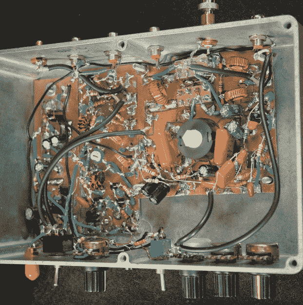
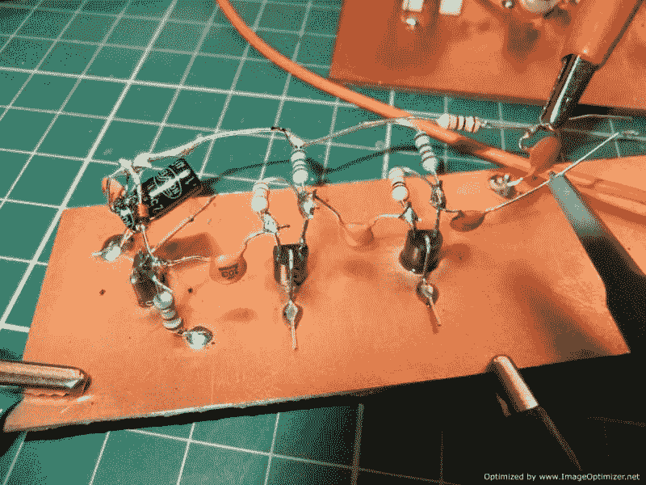
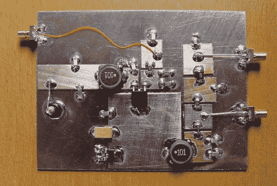
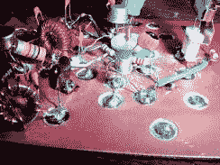
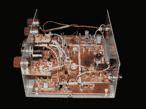
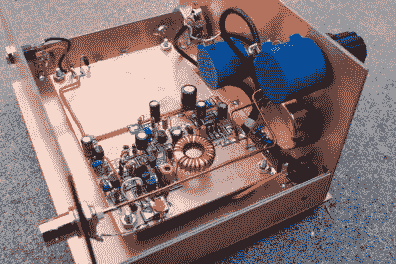
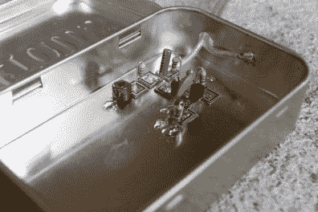

# 变丑，变成死虫子，然后去曼哈顿

> 原文：<https://hackaday.com/2016/05/04/getting-ugly-dead-bugs-and-going-to-manhattan/>

回到 20 世纪 80 年代，我是一名初露头角的电子极客，在一家电视维修店工作。我大部分时间都在给顾客搬电视，但也有一点时间坐在长椅上。那时，新电视完全是固态的，建立在单个 PC 板上，但偶尔我们会有一个老前辈带着经典的手接线电子管底盘进来。我记得我把它们翻过来，看到所有的电容和电阻都焊接在用螺栓固定在铝底盘上的端子板之间，我想知道它们是如何工作的。与带有 System 3 底盘的全新 19 英寸 Zenith 上的光滑痕迹和整洁的机器插入组件相比，这一切看起来如此混乱和凌乱。一句话，旧底盘只是-难看。

回过头来看，我可能不应该如此判断。尽管得益于 KiCad、OSH Park 等技术，PCB 设计取得了数十年的进步，电路板生产也实现了民主化，但事实证明，电路构造的丑陋方法还是有很多值得称道之处。

### 丑就是美

不同于标准表面贴装和通孔 PCB 技术的构造方法各不相同，但这些方法的一个像样的通用术语是“难看的构造”。具体情况各不相同，但这是那种“当你看到它时你就会知道”的事情。在我看来，丑陋的风格是指任何电子构建技术，其中元件不完全机械地固定在基板上，如覆层或未覆层的电路板。对于通孔和 SMT，我们习惯于将每个元件的所有端子牢固地焊接到电路板上，形成牢固的机械和电气连接。Ugly 避开了这种方法，让所有组件都挂在外面。

Ugly is as Ugly does: A 40-meter receiver. [Source](http://qrp-popcorn.blogspot.com/2014_10_01_archive.html)

有时在难看的结构中根本没有电路板，元件只是焊接在端子板上或者输入和输出连接器之间。这样的构建在机械上并不十分合理，所以它们主要是为快速原型保留的。当电路板结构不美观时，它通常只用作接地层，只焊接元件的接地引线。随着接地的建立和某种机械稳定性的增加，其它连接在电路板上方进行。元件引线直接连在一起或用短跳线连在一起，最终整个电路开始连在一起。通过将高阻值电阻接地，可以增加接头的机械稳定性。

长得丑有用吗？你打赌！业余无线电界的一个著名例子是《丑陋的周末旅行者》。由罗杰和韦斯·海沃德在 1981 年设计的“丑陋的周末者”是一个 40 米波段的低功率(QRP)发射机。这个周末旅行者是在圣诞节假期作为父子项目开始的，只需将几个零件钉在一个普通的覆铜板上，就可以完成很多工作。而且丑的快。UW 发射机的“周末”部分指的是这样一个事实，即它可以在一个周末由任何具有合理技能的业余爱好者利用库存充足的零件库来制造。没有 PCB 设计，没有繁琐的光转移或手动掩蔽过程，也没有蚀刻，构建可以立即开始。我觉得这就是丑建造最大的无形好处——不打断创作动力。你有了一个想法，你开始钉零件，然后你就跟着设计流程走。

### 我的电路里有个死虫

A bunch of dead-bug TO-92 devices. [Source](//forums.parallax.com/discussion/163128/manhattan-and-pittsburgh-electronics-prototyping-techniques)

可以想象，丑陋最适合使用分立元件的电路。毕竟，将 14 针 DIP 固定到电路板上是很困难的，对吗？进入丑的“死虫”风格。顾名思义，死 bug 构建的组件的所有线索都像死 Bug 一样悬在空中。有时，dip 和其他组件用少量强力胶粘在电路板上以获得机械稳定性。不过，重要的一点是，互连仍然都发生在电路板上方，接地连接短而直接，数量多。巨大的接地层是 Ugly 的一个重要特征，这也是它经常用于 RF 电路的原因。

丑的另一个好处是杂散电容的减少。无焊试验板是很好的原型制作工具，但无法回避一个事实，即由 0.1 英寸长的平行导体组成的网格，由电介质隔开，会产生电容。[这不是很多](https://www.youtube.com/watch?v=6GIscUsnlM0)，也不是每个电路的一个因素，但这里或那里的几个皮法可能会造成问题。由于引线较短且没有长平行走线，Ugly 可将杂散电容降至最低，这也是许多 RF 电路使用它的另一个原因。

### 帮助丑陋:曼哈顿风格

丑陋只能到此为止，但它并不适合每一条赛道。丑陋往往难以复制——毕竟，当你在空中将四根导线焊接在一起，并用一个 10 兆欧的电阻接地时，要准确记录你做了什么有点困难，甚至一张照片也不一定能做到公正。所以丑陋有时需要一些帮助，这就是曼哈顿风格的用武之地。

曼哈顿建筑以其与一排排高层建筑的相似性而得名，它使用从覆铜板上冲出的小垫片，并将其粘在地面板上。小型铜焊盘与接地层绝缘，用作端子的连接点，不再有悬在半空中的连接，也不再有支持电阻。焊盘可以用冲压工具冲出或创建，甚至可以直接在背板上创建[。IC 可以通过微小的焊盘或较大的焊盘集成到 Manhattan builds 中，较大的焊盘通过用锯小心地在铜上划线。在曼哈顿的大楼里安装集成电路也不是不可能的。](http://hackaday.com/2012/07/20/cutting-islands-into-copper-clad-pcbs-with-a-drill/)

  Manhattan with surface-mount. [Source](http://electronics.stackexchange.com/questions/174082/making-prototypes-with-high-speed-smd-components)  Manhattan-style with islands isolated by a hollow diamond-tipped drill. [Source](http://danscloseoutsandspecialdeals.com/specialdealsandleftovers.html)  K8IQY’s 2N2/30 CW transceiver. [Source](http://www.k8iqy.com/qrprigs/2n230/2N230page.htm)  AA7EE’s 40-m receiver, built Manhattan-style in an enclosure made from PCB. [Source](https://aa7ee.wordpress.com/2011/07/24/the-wbr-a-simple-high-performance-regen-receiver-for-40m-by-n1byt/)  Manhattan meets Altoids. AA7EE’s simple crystal filter. [Source](https://aa7ee.wordpress.com/tag/manhattan-pads/)

你可能会认为曼哈顿只对通孔元件有用，但不会这么快。只要稍加巧妙，即使是表面贴装元件也能融入曼哈顿建筑。根据[【Paul Harden】(NA5N)的曼哈顿指南](http://www.aoc.nrao.edu/~pharden/hobby/HG-MANHAT2.pdf)，由较薄的 0.031”厚覆铜板制成的焊盘和条带可以粘合到较厚的背板上，并用于制作表面贴装器件的着陆焊盘。与任何使用 SMT 的构建一样，事情可能会有点不确定，但是通过足够的预先计划和适当的工具，Manhattan-SMT 可以产生一些非常酷的构建。

很明显，Ugly 和 Manhattan construction 并不适合所有的构建，但是了解这些技术可以打开一些大门，并使电路的构建变得更加容易。正如[Harry Lythall] (SM0VPO) [指出的](http://213.114.136.42/blocks/deadbug_0.htm)，“正确的建造方法是任何一种可行的方法。最好的施工方法是最有效的方法。”也许这些方法中的一种最适合你的下一个项目。

特色图片:【K8IQY】的 SW30+30m 连续波收发器。[来源](http://www.k8iqy.com/qrprigs/sw30+/sw30+page.htm)。