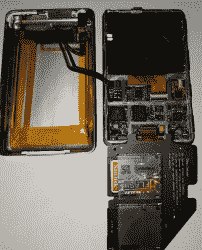

# 赋予第六代 IPod 新的生命

> 原文：<https://hackaday.com/2018/03/30/giving-a-6th-generation-ipod-a-new-lease-on-life/>

当喜欢的设备开始出现故障时，可能会令人沮丧。受几乎没电的电池和烧坏的硬盘的折磨，Redditor [cswimc]感觉到他们的第六代 iPod 即将面临厄运，并以恢复和升级这个破旧设备作为回应！【T2

要撬开这些东西中的一个并不容易，所以他们发现自己花了很长时间，小心翼翼地将撬开工具楔入前盖和后盖之间，绕过外壳。一旦分开，小心翼翼地断开几根带状电缆，iPod 就可以完全打开了。从那时起，他们开始用 iFlash 双 SD 卡板替换原来的硬盘驱动器——其中一张卡被证明是无用的，但 128GB 仍然比 80GB 高一步——和新的 3000mAh 电池。结合更换耗电硬盘，电池寿命比原来的 650mAh 容量大幅增加！

在重新密封 iPod 之前，他们测试了设备是否正常工作，然后运行了恢复和还原功能。他们还用 Rockbox 取代了最初的软件，脱离了 iTunes——尽管这一步是可选的。

还有更大的升级版本——有些可以追溯到 iPods 的全盛时期——但是这个版本防止了外形的失控。

[通过 [/r/DIY](https://www.reddit.com/r/DIY/comments/86q47c/i_revived_an_old_ipod_classic_6th_generation_3k/)