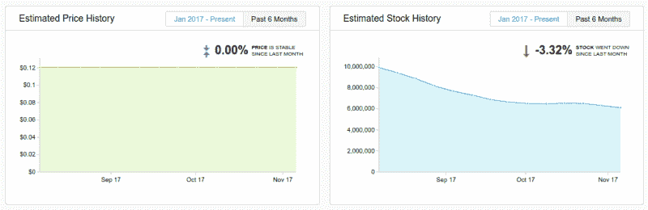
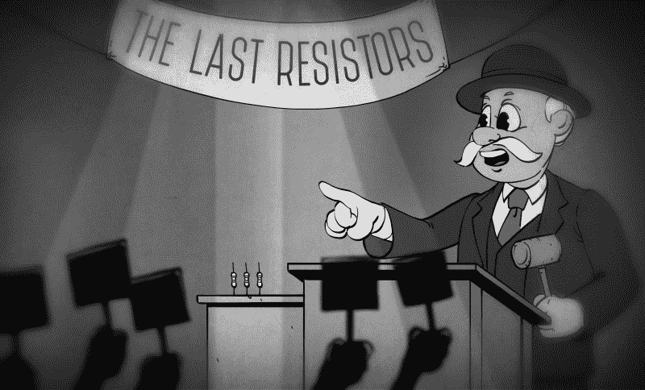

# 全球电阻器短缺、经济学和消费者行为

> 原文：<https://hackaday.com/2018/01/31/global-resistor-shortage-economics-and-consumer-behavior/>

无源元件行业——制造每一个电子设备中都有的乏味但至关重要的电阻、电容和二极管的制造商——正处于短缺的边缘。你总是可以买到 220ω、0805 电阻，但你不会像今天这样一便士买两个，在不久的将来你可能只能买到一个。

Yageo 是最大的表面贴装(SMD)电阻器和多层陶瓷电容器制造商之一，去年 12 月宣布他们不再接受新的片式电阻器订单。据 Digitimes 报道，【Yageo 正在削减廉价芯片电阻器的生产，以专注于汽车、物联网和其他工业用途的更高利润的利基市场组件。本月早些时候，Yaego 恢复了芯片电阻器的订单，但[的报价比](http://digitimes.com:8080/news/a20180112PD208.html)高出 15-20%。

因此，有传言称深圳电子市场出现了无源元件的抢购，电子社区成员的几条推文称，一些元件的价格已经翻了一番。因为每个电子设备都使用这些“软糖”零件，供应减少或价格上涨意味着一些产品不会按时发货，利润率会降低，或者最新电子产品的价格会上涨。

问题仍然是:我们正处于电阻短缺的边缘吗？没有所需零件的制造商会有什么影响？

### 芯片电阻短缺的非正式调查

随着即将出现短缺的消息，你会期望经销商提高价格，购买更多的股票，或采取一些措施来确保未来几年 SMD 电阻的稳定供应。有两种方法可以判断这种情况是否会发生。第一个是来自一家公司的高级分析，它查看成千上万的物料清单，并为工程师提供工具来确定适合其供应链的组件。第二种方法是看一些老的 Mouser 发票。

我在过去购买了几卷 Yageo 电阻器，通过查看我的 Mouser 订单历史，我没有看到从六个月前到今天的价格有任何变化。去年 6 月，Yageo 生产的一卷 5000 个 220ω、0603 电阻售价 10 美元，如今只需 10 美元。当然，这只是一个数据集，为了真正了解库存情况，我们需要更好的数据。

电子元件搜索工具 FindChips Pro (归 SupplyFrame 所有，supply frame 是 Hackaday 的所有者，也是我的付款人)有一个“零件智能”工具，可以查看各种元件的历史价格和库存情况。例如，Yageo 的 RC0603JR-071ML，1mω，0603 厚膜电阻，在过去的六个月里，所有经销商的库存都下降了。2017 年 8 月，约有 1000 万个这种电阻器在所有经销商处销售。今天，已经有超过 600 万种。然而，价格并没有上涨。价格需求曲线何时会赶上库存是一个悬而未决的问题。【[数据源](https://www.findchips.com/analytics/RC0603JR-071ML/2571-YAGEO%20Corporation) —需要登录才能查看历史数据】

### 吸取牛肉消费的教训

芯片电阻器和电容器等重要商品可能短缺的消息可能会让一些人感到震惊，当然这也是一个显而易见的问题:公司应该储备这些软糖零件吗？你应该现在锁定价格，购买一整年的库存吗？如果每个人都这样做，会发生什么？历史告诉我们你不应该。

20 世纪 70 年代初，美国出现了大量消费品短缺，最明显的是天然气短缺。但另一个例子提供了一个很好的视角，说明为什么你不应该在短缺时囤积超出你需求的商品。1971 年，玉米枯萎病袭击了美国东南部的农作物，抬高了牲畜饲料的价格。作为回应，牲畜生产者减少了他们的畜群，肉类价格——尤其是牛肉——大幅上涨。到 1973 年，媒体报道了牛肉短缺，消费者抱怨一块好牛排的价格太高。

也是在 1973 年，亚利桑那大学的年轻考古学家威廉·拉斯杰开始研究垃圾。藏在 1973 年收集的生活垃圾袋里的垃圾会让任何关注牛肉短缺的人感到惊讶。在柚子皮和咖啡渣下面，他发现了用纸巾包着的保存完好的丁字牛排。在 Rathje 的垃圾项目第一季中挖掘出的其他垃圾袋中发现了更多的牛肉块，当它们被丢弃时，表面上看起来完全可以食用。在这些袋子里，你还可以找到报道牛肉短缺的报纸，媒体调查的结果清楚地表明，消费者正在减少他们的牛肉消费。事实上，对垃圾的分析显示，消费者在牛肉短缺期间购买的牛肉是之前或之后的三倍。消费者囤积和抢购，没有意识到牛肉容易腐烂。其他人在购买更便宜、不熟悉的牛肉，他们不知道如何准备。在牛肉短缺期间，牛肉消费增加。人类的心理很奇怪。

牛肉短缺故事的寓意是买你预见需要的东西，而不是你担心得不到的东西。在我们目前的情况下，如果采用后者，将导致大量组件闲置在世界各地的机架和机柜中，而不是在需要时可用。电阻不会像丁字牛排那样迅速变质，但没有人喜欢携带过多的库存，囤积行为肯定会错误分配稀缺资源。

不必要的囤积可能是不好的，但电子行业也非常怪异。在这个世界上，没有任何一个行业可以让一个普通人买到世界供应的东西。我自己无意中做了这个*。*此外，商用电阻市场不同于稀有元件市场，在稀有元件市场中，能够采购到一个器件决定了产品发布的成败。这很可能是暂时现象。市场上有足够的库存，市场力量将最终占据上风，要求电阻器制造商加快生产线，多生产几千卷电阻器。但在那之前，我们很可能会看到芯片电阻价格上涨，可能会增加几美分的 BOM 成本。